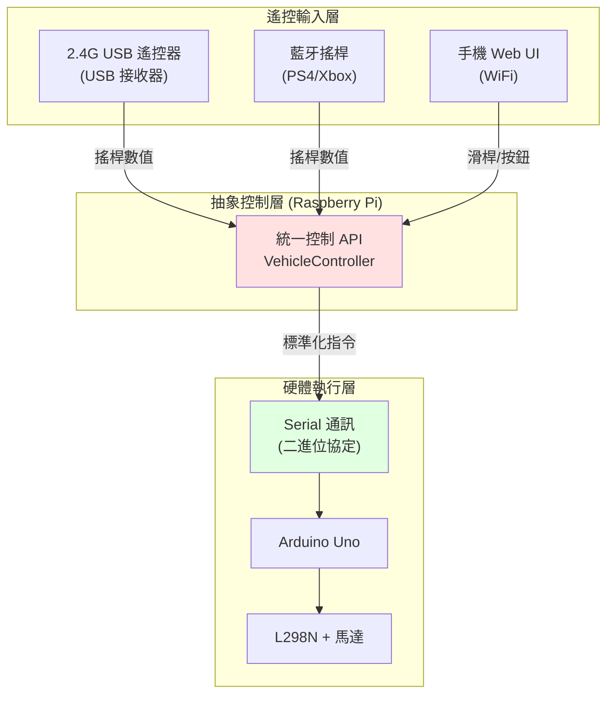

# 遙控方案架構設計

## 專題階段規劃

### 階段 1：遙控模式（初期目標）
使用外部控制器進行手動駕駛，驗證硬體與基礎功能。

**優先方案：2.4G USB 遙控器**
- USB 接收器插入 Raspberry Pi
- 低延遲（< 20ms）
- 即插即用，無需配對
- 穩定可靠

**備案方案：**
- 藍牙搖桿（PS4/Xbox 控制器）
- 手機 Web UI（WiFi 連線）

### 階段 2：視覺自走模式（後期目標）
基於 Pi Camera 的自主導航。

**功能需求：**
- 路徑偵測與追蹤
- 障礙物避障（超聲波 + 視覺）
- 自主決策與控制

## 統一通訊架構

為了快速切換遙控方案，設計**抽象控制層**，所有遙控方式輸出統一格式：



### 統一控制 API 設計

所有遙控輸入轉換為標準格式：

```python
class VehicleCommand:
    """統一車輛控制指令"""
    def __init__(self):
        self.linear_velocity = 0.0   # -1.0 ~ 1.0 (前進/後退)
        self.angular_velocity = 0.0  # -1.0 ~ 1.0 (左轉/右轉)
        self.mode = "MANUAL"         # MANUAL / AUTO / STOP
```

**輸入來源 → API 轉換：**

| 輸入來源 | 原始資料 | 轉換邏輯 |
|---------|---------|---------|
| 2.4G 搖桿 | 搖桿 X/Y (0-255) | 正規化到 -1.0 ~ 1.0 |
| 藍牙搖桿 | 左搖桿 Y / 右搖桿 X | 直接映射 |
| Web 滑桿 | 速度 (0-100) / 方向 (-100~100) | 正規化到 -1.0 ~ 1.0 |
| 視覺自走 | 路徑偏差角度 | PID 控制器計算 |

## 方案 1：2.4G USB 遙控器（優先）

### 硬體需求

**遙控器組合：**
- 2.4G 無線遙控器（搖桿型）
- USB 接收器（Dongle）
- 直接插入 Raspberry Pi USB 埠

**優勢：**
- ✅ **即插即用**：接收器插 USB，自動識別為 `/dev/input/jsX` 或 `/dev/input/eventX`
- ✅ **低延遲**：< 20ms
- ✅ **無需焊接**：不需要 NRF24L01 模組與接線
- ✅ **穩定可靠**：商用遙控器品質較佳
- ✅ **省電**：遙控器通常使用 AA 電池，續航數月

**常見遙控器型號：**
- 羅技 F310 / F710 遙控器
- 小米遊戲手把
- Xbox Wireless Adapter for Windows
- 任何支援 Linux 的 USB 遙控器

### 硬體連接

```
2.4G 遙控器 (手持)
    |
    | 2.4GHz 無線
    ↓
USB 接收器 (Dongle)
    |
    | USB 線
    ↓
Raspberry Pi USB 埠
```

**無需額外接線！**

### 測試遙控器連接

插入 USB 接收器後，檢查是否被系統識別：

```bash
# 列出輸入設備
ls /dev/input/

# 查看搖桿設備（通常是 js0）
ls /dev/input/js*

# 或查看事件設備
ls /dev/input/event*

# 查看設備詳細資訊
cat /proc/bus/input/devices

# 即時測試搖桿輸入（需安裝 jstest）
sudo apt install joystick
jstest /dev/input/js0
```

**預期輸出：**
```
Driver version is 2.1.0.
Joystick (Wireless Controller) has 6 axes (X, Y, Z, Rx, Ry, Rz)
and 12 buttons (BtnA, BtnB, BtnX, BtnY, BtnTL, BtnTR, ...).
```

### Raspberry Pi 接收程式碼

使用 **pygame** 函式庫讀取 USB 遙控器（最簡單的方式）：

```python
#!/usr/bin/env python3
"""2.4G USB 遙控器接收 - 使用 pygame"""

import pygame
import time

class USB24GReceiver:
    def __init__(self, joystick_id=0):
        pygame.init()
        pygame.joystick.init()

        # 等待遙控器連接
        while pygame.joystick.get_count() == 0:
            print("等待遙控器連接...")
            time.sleep(1)

        self.joystick = pygame.joystick.Joystick(joystick_id)
        self.joystick.init()

        print(f"✅ 遙控器已連接: {self.joystick.get_name()}")
        print(f"   搖桿軸數: {self.joystick.get_numaxes()}")
        print(f"   按鈕數: {self.joystick.get_numbuttons()}")

    def receive(self):
        """接收遙控資料，返回 VehicleCommand"""
        pygame.event.pump()  # 更新事件

        # 讀取搖桿軸（通常左搖桿控制移動）
        # 注意：不同遙控器的軸編號可能不同，需實測調整
        left_y = -self.joystick.get_axis(1)   # 左搖桿 Y（前進/後退）
        left_x = self.joystick.get_axis(0)    # 左搖桿 X（左轉/右轉）

        # 或使用右搖桿控制轉向
        # right_x = self.joystick.get_axis(2)

        # 死區處理（避免飄移）
        if abs(left_y) < 0.1:
            left_y = 0.0
        if abs(left_x) < 0.1:
            left_x = 0.0

        # 轉換為統一格式
        cmd = VehicleCommand()
        cmd.linear_velocity = left_y          # -1.0 ~ 1.0
        cmd.angular_velocity = -left_x        # -1.0 ~ 1.0（可能需要反向）
        cmd.mode = "MANUAL"

        # 讀取按鈕（例如緊急停止）
        if self.joystick.get_button(0):  # 按鈕 A/X
            cmd.mode = "STOP"

        return cmd

class VehicleCommand:
    """統一車輛控制指令"""
    def __init__(self):
        self.linear_velocity = 0.0   # -1.0 ~ 1.0
        self.angular_velocity = 0.0  # -1.0 ~ 1.0
        self.mode = "MANUAL"

# 測試程式
if __name__ == "__main__":
    receiver = USB24GReceiver()

    try:
        while True:
            cmd = receiver.receive()

            print(f"Linear: {cmd.linear_velocity:+.2f}  "
                  f"Angular: {cmd.angular_velocity:+.2f}  "
                  f"Mode: {cmd.mode}", end='\r')

            time.sleep(0.02)  # 50Hz

    except KeyboardInterrupt:
        print("\n✋ 停止")
        pygame.quit()
```

### 使用 evdev 函式庫（進階方式）

若需要更底層的控制，可使用 `evdev`：

```python
#!/usr/bin/env python3
"""2.4G USB 遙控器接收 - 使用 evdev"""

from evdev import InputDevice, categorize, ecodes
import time

class USB24GReceiverEvdev:
    def __init__(self, device_path='/dev/input/event0'):
        self.device = InputDevice(device_path)
        print(f"✅ 連接設備: {self.device.name}")

        # 軸值暫存
        self.axes = {
            ecodes.ABS_X: 0,  # 左搖桿 X
            ecodes.ABS_Y: 0,  # 左搖桿 Y
        }

    def receive(self):
        """非阻塞讀取遙控資料"""
        # 讀取所有可用事件
        for event in self.device.read():
            if event.type == ecodes.EV_ABS:
                if event.code in self.axes:
                    # 正規化軸值（通常 0-255 或 0-32767）
                    # 需根據實際遙控器調整
                    normalized = (event.value - 128) / 128.0  # -1.0 ~ 1.0
                    self.axes[event.code] = normalized

        # 轉換為統一格式
        cmd = VehicleCommand()
        cmd.linear_velocity = -self.axes.get(ecodes.ABS_Y, 0)
        cmd.angular_velocity = -self.axes.get(ecodes.ABS_X, 0)
        cmd.mode = "MANUAL"

        return cmd

# 安裝 evdev
# pip3 install evdev
```

### 安裝相依套件

```bash
# 安裝 pygame（推薦，最簡單）
sudo apt install python3-pygame

# 或安裝 evdev（進階）
pip3 install evdev

# 測試工具
sudo apt install joystick
```

### 軸編號測試工具

不同遙控器的軸編號可能不同，使用以下腳本測試：

```python
#!/usr/bin/env python3
"""測試遙控器的軸和按鈕編號"""

import pygame
import time

pygame.init()
pygame.joystick.init()

joystick = pygame.joystick.Joystick(0)
joystick.init()

print(f"遙控器: {joystick.get_name()}")
print(f"軸數: {joystick.get_numaxes()}")
print(f"按鈕數: {joystick.get_numbuttons()}")
print("\n移動搖桿或按按鈕來查看編號...\n")

try:
    while True:
        pygame.event.pump()

        # 顯示所有軸的值
        for i in range(joystick.get_numaxes()):
            value = joystick.get_axis(i)
            if abs(value) > 0.1:  # 過濾小值
                print(f"Axis {i}: {value:+.2f}  ", end='')

        # 顯示按下的按鈕
        for i in range(joystick.get_numbuttons()):
            if joystick.get_button(i):
                print(f"Button {i} pressed  ", end='')

        print("\r", end='')
        time.sleep(0.05)

except KeyboardInterrupt:
    print("\n結束測試")
    pygame.quit()
```

**使用方式：**
```bash
python3 test_joystick.py
```

移動搖桿和按按鈕，記錄編號後修改主程式的軸編號。

### 常見軸配置

| 遙控器類型 | 左搖桿 X | 左搖桿 Y | 右搖桿 X | 右搖桿 Y |
|----------|---------|---------|---------|---------|
| 羅技 F310 | Axis 0 | Axis 1 | Axis 3 | Axis 4 |
| PS4 手把 | Axis 0 | Axis 1 | Axis 2 | Axis 5 |
| Xbox 手把 | Axis 0 | Axis 1 | Axis 3 | Axis 4 |
| 通用搖桿 | Axis 0 | Axis 1 | Axis 2 | Axis 3 |

### 優點總結

使用 USB 2.4G 遙控器的好處：

1. ✅ **簡化硬體**：不需要 NRF24L01 模組、焊接、接線
2. ✅ **降低成本**：商用遙控器比自製便宜（約 $10-30）
3. ✅ **提高可靠性**：商用產品品質較佳，測試充分
4. ✅ **加速開發**：直接用 pygame 讀取，5 分鐘搞定
5. ✅ **易於除錯**：jstest 工具可即時查看輸入
6. ✅ **省電**：遙控器用 AA 電池，續航數月
7. ✅ **符合專題時程**：減少硬體製作時間，專注軟體開發

### 疑難排解

**問題 1：找不到 /dev/input/js0**

```bash
# 安裝 joystick 核心模組
sudo modprobe joydev

# 檢查 USB 設備
lsusb

# 查看核心訊息
dmesg | tail -20
```

**問題 2：pygame 找不到遙控器**

```bash
# 重新初始化
sudo udevadm trigger

# 檢查權限
ls -l /dev/input/js0

# 加入使用者到 input 群組
sudo usermod -a -G input $USER
# 登出後重新登入生效
```

**問題 3：軸值飄移**

調整程式中的死區值（deadzone）：

```python
if abs(value) < 0.15:  # 增加死區
    value = 0.0
```

## 方案 2：藍牙搖桿（備案 A）

### 硬體需求

- PS4 DualShock / Xbox 控制器
- Raspberry Pi 內建藍牙（Pi 3/4/5）

### 優點
- ✅ 無需額外硬體
- ✅ 搖桿手感好
- ✅ 多按鈕可擴充功能

### 缺點
- ⚠️ 配對流程較複雜
- ⚠️ 延遲較高（30-50ms）
- ⚠️ 藍牙干擾問題

### Raspberry Pi 程式碼

```python
#!/usr/bin/env python3
"""藍牙搖桿控制 - 使用 pygame"""

import pygame
import time

class BluetoothJoystickReceiver:
    def __init__(self):
        pygame.init()
        pygame.joystick.init()

        # 等待搖桿連接
        while pygame.joystick.get_count() == 0:
            print("等待搖桿連接...")
            time.sleep(1)

        self.joystick = pygame.joystick.Joystick(0)
        self.joystick.init()

        print(f"搖桿已連接: {self.joystick.get_name()}")

    def receive(self):
        """接收搖桿資料"""
        pygame.event.pump()

        # PS4 控制器軸配置
        left_y = -self.joystick.get_axis(1)   # 左搖桿 Y（前進/後退）
        right_x = self.joystick.get_axis(2)   # 右搖桿 X（左轉/右轉）

        # 死區處理
        if abs(left_y) < 0.1:
            left_y = 0.0
        if abs(right_x) < 0.1:
            right_x = 0.0

        # 轉換為統一格式
        cmd = VehicleCommand()
        cmd.linear_velocity = left_y
        cmd.angular_velocity = right_x
        cmd.mode = "MANUAL"

        return cmd

# 配對指令
"""
sudo bluetoothctl
[bluetooth]# agent on
[bluetooth]# default-agent
[bluetooth]# scan on
# 找到 PS4 控制器 MAC 地址
[bluetooth]# pair XX:XX:XX:XX:XX:XX
[bluetooth]# connect XX:XX:XX:XX:XX:XX
[bluetooth]# trust XX:XX:XX:XX:XX:XX
"""
```

## 方案 3：手機 Web UI（備案 B）

### 架構

- Flask Web 伺服器（Raspberry Pi）
- 手機瀏覽器作為控制介面
- WiFi 連線（可用手機熱點或獨立 AP）

### 優點
- ✅ 無需額外硬體
- ✅ 介面自由度高
- ✅ 可顯示感測器資料/相機畫面

### 缺點
- ⚠️ WiFi 延遲較高（50-100ms）
- ⚠️ 手機觸控不如搖桿精確

### Flask 伺服器程式碼

```python
#!/usr/bin/env python3
"""Web UI 遙控伺服器"""

from flask import Flask, render_template, request, jsonify
import threading

app = Flask(__name__)

# 全域變數儲存控制指令
current_command = VehicleCommand()
command_lock = threading.Lock()

@app.route('/')
def index():
    """主控制頁面"""
    return render_template('control.html')

@app.route('/api/control', methods=['POST'])
def control():
    """接收控制指令 API"""
    global current_command

    data = request.json

    with command_lock:
        current_command.linear_velocity = float(data.get('linear', 0))
        current_command.angular_velocity = float(data.get('angular', 0))
        current_command.mode = data.get('mode', 'MANUAL')

    return jsonify({"status": "ok"})

@app.route('/api/status', methods=['GET'])
def status():
    """回傳車輛狀態"""
    # 這裡可以加入感測器資料
    return jsonify({
        "ultrasonic_left": 50.0,
        "ultrasonic_right": 60.0,
        "battery": 11.2
    })

def get_current_command():
    """供主程式取得當前指令"""
    with command_lock:
        return current_command

if __name__ == "__main__":
    app.run(host='0.0.0.0', port=5000, debug=False)
```

### HTML 控制介面

```html
<!-- templates/control.html -->
<!DOCTYPE html>
<html>
<head>
    <title>機器人遙控器</title>
    <meta name="viewport" content="width=device-width, initial-scale=1">
    <style>
        body {
            font-family: Arial;
            text-align: center;
            background: #222;
            color: #fff;
        }
        .joystick-container {
            margin: 50px auto;
            width: 300px;
            height: 300px;
            border: 2px solid #fff;
            border-radius: 50%;
            position: relative;
        }
        .joystick-thumb {
            width: 80px;
            height: 80px;
            background: #f00;
            border-radius: 50%;
            position: absolute;
            top: 110px;
            left: 110px;
        }
        .status {
            margin: 20px;
            font-size: 18px;
        }
    </style>
</head>
<body>
    <h1>機器人遙控器</h1>

    <div class="joystick-container" id="joystick">
        <div class="joystick-thumb" id="thumb"></div>
    </div>

    <div class="status">
        <p>速度: <span id="speed">0</span></p>
        <p>轉向: <span id="turn">0</span></p>
    </div>

    <button onclick="stopRobot()" style="font-size: 24px; padding: 15px 40px;">
        緊急停止
    </button>

    <script>
        // 虛擬搖桿邏輯
        const joystick = document.getElementById('joystick');
        const thumb = document.getElementById('thumb');
        let isDragging = false;

        function sendCommand(linear, angular) {
            fetch('/api/control', {
                method: 'POST',
                headers: {'Content-Type': 'application/json'},
                body: JSON.stringify({
                    linear: linear,
                    angular: angular,
                    mode: 'MANUAL'
                })
            });

            document.getElementById('speed').textContent = linear.toFixed(2);
            document.getElementById('turn').textContent = angular.toFixed(2);
        }

        joystick.addEventListener('touchstart', (e) => {
            isDragging = true;
        });

        joystick.addEventListener('touchmove', (e) => {
            if (!isDragging) return;
            e.preventDefault();

            const rect = joystick.getBoundingClientRect();
            const centerX = rect.width / 2;
            const centerY = rect.height / 2;

            const touch = e.touches[0];
            const x = touch.clientX - rect.left - centerX;
            const y = touch.clientY - rect.top - centerY;

            // 限制在圓內
            const distance = Math.sqrt(x*x + y*y);
            const maxDist = 110;

            let finalX = x;
            let finalY = y;

            if (distance > maxDist) {
                finalX = (x / distance) * maxDist;
                finalY = (y / distance) * maxDist;
            }

            // 更新拇指位置
            thumb.style.left = (centerX + finalX - 40) + 'px';
            thumb.style.top = (centerY + finalY - 40) + 'px';

            // 發送指令（正規化到 -1~1）
            const linear = -finalY / maxDist;
            const angular = -finalX / maxDist;
            sendCommand(linear, angular);
        });

        joystick.addEventListener('touchend', () => {
            isDragging = false;
            thumb.style.left = '110px';
            thumb.style.top = '110px';
            sendCommand(0, 0);
        });

        function stopRobot() {
            sendCommand(0, 0);
        }
    </script>
</body>
</html>
```

## Arduino-Pi 二進位通訊協定

### 協定設計

**封包格式（8 bytes）**

| Byte | 內容 | 範圍 | 說明 |
|------|-----|------|------|
| 0 | Header | 0xAA | 起始標記 |
| 1-2 | Left Motor | -255 ~ 255 | 左輪 PWM (int16) |
| 3-4 | Right Motor | -255 ~ 255 | 右輪 PWM (int16) |
| 5 | Flags | 0-255 | 控制旗標 |
| 6 | Checksum | 0-255 | XOR 校驗 |
| 7 | Footer | 0x55 | 結束標記 |

**Flags 位元定義：**
- Bit 0: 急停 (Emergency Stop)
- Bit 1: 保留
- Bit 2-7: 預留擴充

### Raspberry Pi 發送端

```python
#!/usr/bin/env python3
"""Pi → Arduino 二進位通訊"""

import serial
import struct
import time

class ArduinoController:
    def __init__(self, port='/dev/ttyAMA0', baudrate=57600):
        self.serial = serial.Serial(port, baudrate, timeout=0.1)
        time.sleep(2)  # 等待 Arduino 重置
        print(f"Serial connected: {port} @ {baudrate}")

    def send_command(self, vehicle_cmd):
        """發送統一指令到 Arduino"""
        # 差動驅動轉換：線速度 + 角速度 → 左右輪速度
        left_speed = vehicle_cmd.linear_velocity - vehicle_cmd.angular_velocity
        right_speed = vehicle_cmd.linear_velocity + vehicle_cmd.angular_velocity

        # 限制範圍 -1.0 ~ 1.0
        left_speed = max(-1.0, min(1.0, left_speed))
        right_speed = max(-1.0, min(1.0, right_speed))

        # 轉換為 PWM 值 (-255 ~ 255)
        left_pwm = int(left_speed * 255)
        right_pwm = int(right_speed * 255)

        # 組裝封包
        flags = 0x00
        if vehicle_cmd.mode == "STOP":
            flags |= 0x01  # 急停旗標

        packet = bytearray([
            0xAA,  # Header
            left_pwm & 0xFF,
            (left_pwm >> 8) & 0xFF,
            right_pwm & 0xFF,
            (right_pwm >> 8) & 0xFF,
            flags,
            0,  # Checksum (稍後計算)
            0x55  # Footer
        ])

        # 計算 XOR 校驗和
        checksum = 0
        for i in range(1, 6):
            checksum ^= packet[i]
        packet[6] = checksum

        # 發送
        self.serial.write(packet)

    def close(self):
        self.serial.close()
```

### Arduino 接收端

```cpp
/**
 * Arduino 接收 Pi 的二進位指令
 */

// L298N 接腳
const int IN1 = 5, IN2 = 6, ENA = 3;
const int IN3 = 9, IN4 = 10, ENB = 11;

// 通訊緩衝區
const int PACKET_SIZE = 8;
uint8_t rxBuffer[PACKET_SIZE];
int rxIndex = 0;

void setup() {
  Serial.begin(57600);

  // 馬達腳位
  pinMode(IN1, OUTPUT);
  pinMode(IN2, OUTPUT);
  pinMode(IN3, OUTPUT);
  pinMode(IN4, OUTPUT);
  pinMode(ENA, OUTPUT);
  pinMode(ENB, OUTPUT);

  Serial.println("Arduino Motor Controller Ready");
}

void loop() {
  // 接收封包
  if (Serial.available() > 0) {
    uint8_t inByte = Serial.read();

    // 尋找 Header
    if (rxIndex == 0 && inByte != 0xAA) {
      return;  // 丟棄非 Header 開頭的資料
    }

    rxBuffer[rxIndex++] = inByte;

    // 封包接收完成
    if (rxIndex == PACKET_SIZE) {
      rxIndex = 0;

      // 驗證 Footer
      if (rxBuffer[7] != 0x55) {
        Serial.println("ERR: Invalid footer");
        return;
      }

      // 驗證校驗和
      uint8_t checksum = 0;
      for (int i = 1; i < 6; i++) {
        checksum ^= rxBuffer[i];
      }

      if (checksum != rxBuffer[6]) {
        Serial.println("ERR: Checksum mismatch");
        return;
      }

      // 解析資料
      int16_t leftPWM = (int16_t)(rxBuffer[1] | (rxBuffer[2] << 8));
      int16_t rightPWM = (int16_t)(rxBuffer[3] | (rxBuffer[4] << 8));
      uint8_t flags = rxBuffer[5];

      // 急停檢查
      if (flags & 0x01) {
        stopMotors();
        Serial.println("EMERGENCY STOP");
        return;
      }

      // 控制馬達
      setMotor(leftPWM, IN1, IN2, ENA);
      setMotor(rightPWM, IN3, IN4, ENB);

      // Debug 輸出
      Serial.print("L:"); Serial.print(leftPWM);
      Serial.print(" R:"); Serial.println(rightPWM);
    }
  }
}

void setMotor(int16_t speed, int in1, int in2, int enable) {
  if (speed >= 0) {
    digitalWrite(in1, HIGH);
    digitalWrite(in2, LOW);
    analogWrite(enable, speed);
  } else {
    digitalWrite(in1, LOW);
    digitalWrite(in2, HIGH);
    analogWrite(enable, -speed);
  }
}

void stopMotors() {
  analogWrite(ENA, 0);
  analogWrite(ENB, 0);
}
```

## 統一控制主程式

整合所有遙控方案的主程式：

```python
#!/usr/bin/env python3
"""統一遙控主程式 - 快速切換方案"""

import time
import argparse

# 匯入各種遙控接收器
from usb_24g_receiver import USB24GReceiver
from bt_joystick import BluetoothJoystickReceiver
from web_ui import WebUIReceiver

# Arduino 控制器
from arduino_controller import ArduinoController

class RobotController:
    def __init__(self, receiver_type='2.4g'):
        # 初始化 Arduino 通訊
        self.arduino = ArduinoController('/dev/ttyAMA0', 57600)

        # 根據參數選擇遙控接收器
        if receiver_type == '2.4g':
            self.receiver = USB24GReceiver()
            print("✅ 使用 2.4G USB 遙控器")
        elif receiver_type == 'bluetooth':
            self.receiver = BluetoothJoystickReceiver()
            print("使用藍牙搖桿")
        elif receiver_type == 'web':
            self.receiver = WebUIReceiver()
            print("使用 Web UI")
        else:
            raise ValueError(f"Unknown receiver type: {receiver_type}")

    def run(self):
        """主控制迴圈"""
        print("機器人控制啟動，按 Ctrl+C 停止")

        try:
            while True:
                # 接收遙控指令（統一格式）
                cmd = self.receiver.receive()

                if cmd:
                    # 發送到 Arduino
                    self.arduino.send_command(cmd)

                time.sleep(0.02)  # 50Hz 控制頻率

        except KeyboardInterrupt:
            print("\n停止控制")
            # 發送停止指令
            stop_cmd = VehicleCommand()
            stop_cmd.mode = "STOP"
            self.arduino.send_command(stop_cmd)

        finally:
            self.arduino.close()

if __name__ == "__main__":
    parser = argparse.ArgumentParser(description='機器人遙控系統')
    parser.add_argument('--mode', choices=['2.4g', 'bluetooth', 'web'],
                        default='2.4g', help='遙控模式')

    args = parser.parse_args()

    controller = RobotController(args.mode)
    controller.run()
```

**切換遙控方式只需改變啟動參數：**

```bash
# 2.4G 遙控器
python3 robot_controller.py --mode 2.4g

# 藍牙搖桿
python3 robot_controller.py --mode bluetooth

# Web UI
python3 robot_controller.py --mode web
```

## 階段 2：視覺自走模式

未來加入視覺導航時，只需新增 `VisionNavigator` 類別，同樣輸出 `VehicleCommand` 格式即可無縫整合：

```python
class VisionNavigator:
    def compute_command(self, camera_frame, ultrasonic_data):
        """根據視覺與感測器計算控制指令"""
        cmd = VehicleCommand()

        # 路徑偵測邏輯
        # ...

        cmd.linear_velocity = 0.5  # 計算結果
        cmd.angular_velocity = 0.1
        cmd.mode = "AUTO"

        return cmd
```

---

**文檔版本：** 2.0
**最後更新：** 2025-10-31
**優先方案：** 2.4G USB 遙控器（即插即用）
