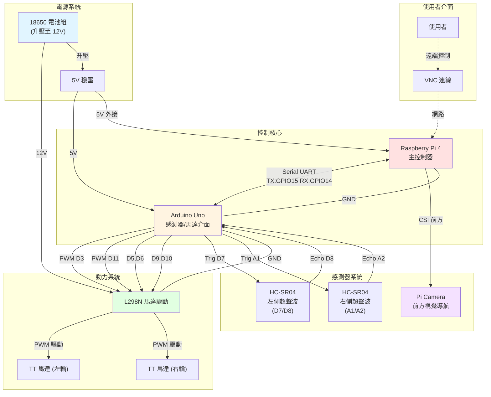
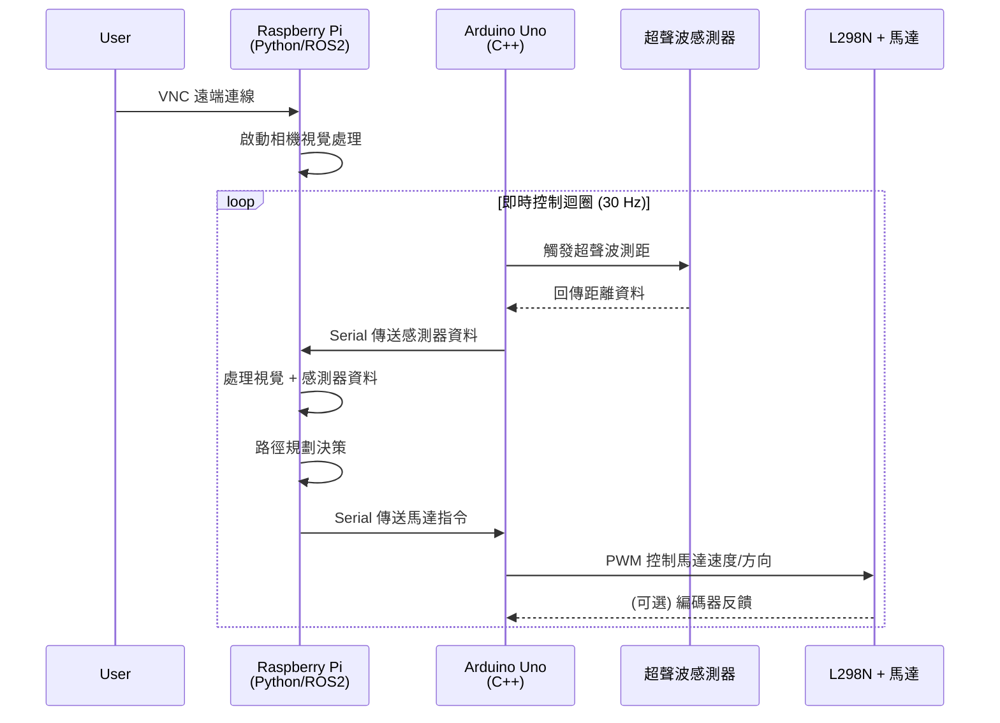

# 機電小車系統架構文檔

## 系統概述

這是一個基於 Raspberry Pi 4 + Arduino Uno 的自主導航機器人系統，具備：
- 超聲波障礙偵測（**左右兩側**防撞）
- L298N 雙馬達差動驅動（開環控制）
- Pi Camera **前方**視覺導航
- 二進位串列通訊協調控制
- 多方案遙控系統（2.4G / 藍牙 / Web UI）
- VNC 遠端監控

## 系統架構圖 (Mermaid)



## 硬體連接表

### 1. L298N 馬達驅動器

| L298N 腳位 | Arduino 腳位 | 功能 | 說明 |
|-----------|-------------|------|------|
| IN1 | D5 | 左輪方向 A | 數位輸出 |
| IN2 | D6 | 左輪方向 B | 數位輸出 |
| IN3 | D9 | 右輪方向 A | 數位輸出 |
| IN4 | D10 | 右輪方向 B | 數位輸出 |
| ENA | D3 (PWM) | 左輪速度控制 | PWM 輸出 (0-255) |
| ENB | D11 (PWM) | 右輪速度控制 | PWM 輸出 (0-255) |
| +12V | 18650→升壓→12V | 馬達電源 | 與 Arduino 5V 共地 |
| 5V | 5V | 邏輯電源 | 來自 Arduino 或外部 |
| GND | GND | 共地 | **必須與 Arduino、RPi 共地** |

**跳線設定：**
- ✅ 移除 ENA/ENB 跳線（啟用 PWM 速度控制）
- ⚠️ 視電源電壓決定 5V 調節器跳線（12V 輸入時保留，< 7V 時移除）

### 2. 超聲波感測器

#### 左側超聲波 (HC-SR04 #1)
| HC-SR04 腳位 | Arduino 腳位 | 功能 |
|-------------|-------------|------|
| VCC | 5V | 電源 |
| Trig | D7 | 觸發脈衝 |
| Echo | D8 | 回波信號 |
| GND | GND | 接地 |

**偵測範圍：** 2-400 cm
**安裝位置：** 車身左側，45° 朝外

#### 右側超聲波 (HC-SR04 #2)
| HC-SR04 腳位 | Arduino 腳位 | 功能 |
|-------------|-------------|------|
| VCC | 5V | 電源 |
| Trig | A1 | 觸發脈衝 |
| Echo | A2 | 回波信號 |
| GND | GND | 接地 |

**偵測範圍：** 2-400 cm
**安裝位置：** 車身右側，45° 朝外

**設計理由：**
- 前方由 Pi Camera 負責視覺偵測
- 左右超聲波覆蓋側面盲區，防止刮撞牆壁
- 45° 安裝角度提供最佳側面覆蓋範圍

### 3. Arduino ↔ Raspberry Pi 串列通訊

| Arduino | Raspberry Pi | 功能 | 說明 |
|---------|-------------|------|------|
| D2 (TX) | GPIO15 / RXD (pin 10) | Pi ← Arduino | Arduino 發送資料 |
| D4 (RX) | GPIO14 / TXD (pin 8) | Pi → Arduino | Arduino 接收指令 |
| GND | GND (pin 6, 9, 14...) | 共地 | **必須共地** |

**通訊協定：**
- 鮑率：57600 bps（或 115200）
- 格式：8N1 (8 位元，無校驗，1 停止位)
- 資料格式：文字指令或二進位協定

### 4. Pi Camera

| Pi Camera | Raspberry Pi | 功能 |
|-----------|-------------|------|
| Ribbon Cable | CSI Port | 視訊串流 |

**配置：**
- Pi Camera V2 或 V3
- 解析度：640×480 @ 30fps（平衡效能與處理速度）
- 用途：視覺導航、物體偵測、SLAM

### 5. 電源系統

| 元件 | 電源來源 | 電壓 | 說明 |
|------|---------|------|------|
| Arduino Uno | 18650 → 5V 穩壓模組 | 5V | Vin 或 5V pin |
| Raspberry Pi 4 | 外接 5V/3A 或共用穩壓 | 5V | USB-C 或 GPIO 5V pin |
| L298N 邏輯 | Arduino 5V | 5V | 共用 Arduino 電源 |
| L298N 馬達 | 18650 → 升壓 12V | 12V | 獨立馬達電源 |
| TT 馬達 | L298N 輸出 | 9-12V | PWM 調速 |

**⚠️ 重要提醒：**
1. **共地連接**：所有 GND 必須連接在一起
2. **電源分離**：馬達電源 (12V) 和邏輯電源 (5V) 分開供電
3. **Pi 電源**：建議使用獨立 5V/3A 供電（Pi 4 耗電較大）

## 軟體架構

### 控制流程



### Arduino 功能職責

**主要任務：**
1. ✅ 讀取雙超聲波感測器（前方 + 側邊）
2. ✅ 接收 Raspberry Pi 的馬達控制指令
3. ✅ 輸出 PWM 控制 L298N 驅動馬達
4. ✅ 回傳感測器資料給 Raspberry Pi
5. ⚠️ (可選) 讀取編碼器進行閉環速度控制

**優點：**
- 即時性高（硬體中斷處理感測器）
- 不受 Pi 系統負載影響
- 降低 Pi 的 GPIO 負擔

### Raspberry Pi 功能職責

**主要任務：**
1. ✅ 高層決策與路徑規劃
2. ✅ Pi Camera 視覺處理（OpenCV/SLAM）
3. ✅ 整合超聲波與視覺資料
4. ✅ 透過 Serial 向 Arduino 發送控制指令
5. ✅ VNC 遠端監控介面
6. ⚠️ (可選) ROS2 導航堆疊

**優點：**
- 強大的運算能力處理視覺
- Python 開發快速
- 支援 WiFi/藍牙通訊

## 通訊協定設計

### Serial 指令格式（建議）

#### Pi → Arduino (馬達控制指令)

**文字協定：**
```
M<左輪速度>,<右輪速度>\n
```
- 左輪速度：-255 ~ 255（負數 = 倒退）
- 右輪速度：-255 ~ 255

**範例：**
- `M100,100\n` - 直行前進（速度 100）
- `M150,50\n` - 右轉（左輪快，右輪慢）
- `M0,0\n` - 停止
- `M-100,-100\n` - 倒退

#### Arduino → Pi (感測器資料)

**文字協定：**
```
S<前方距離>,<側邊距離>\n
```
- 距離單位：公分 (cm)

**範例：**
- `S45.3,120.5\n` - 前方 45.3cm，側邊 120.5cm
- `S999,999\n` - 超出測量範圍

### 更新頻率

- **感測器讀取**：50-100 Hz（Arduino 側）
- **Serial 傳輸**：30 Hz（平衡資料量與即時性）
- **視覺處理**：10-30 Hz（視 Pi 運算能力）
- **馬達控制**：30-50 Hz（足夠平滑控制）

## 系統特色分析

### ✅ 優點

1. **職責分離**：Arduino 處理即時任務，Pi 處理高階運算
2. **雙超聲波**：前方 + 側邊覆蓋更廣，提升安全性
3. **視覺整合**：可實現 SLAM 或物體追蹤
4. **擴充性強**：可加入 IMU、編碼器、GPS 等
5. **遠端控制**：VNC 方便調試與監控

### ⚠️ 系統配置確認

1. **編碼器**：❌ 無編碼器（開環控制）
   - 影響：速度可能不精準，需靠時間估算
   - 對策：使用固定 PWM 值校準，或加入 IMU 輔助估算

2. **電源配置**：✅ 3S 18650 (3×3.7V = 11.1V 標稱)
   - 電壓範圍：9V ~ 12.6V（放電到充飽）
   - 升壓需求：5V/3A 給 Pi + Arduino（使用 DC-DC 降壓模組）
   - 馬達電源：直接供給 L298N（11.1V 適合）

3. **超聲波位置**：✅ 兩側安裝（左右各一）
   - 前方：Pi Camera 視覺導航
   - 側邊：HC-SR04 防撞偵測
   - 建議角度：45° 朝外，覆蓋側面盲區

4. **通訊協定**：✅ 二進位格式
   - 優點：高效、低延遲、適合高頻控制
   - 缺點：調試較難（需工具解析）
   - 建議：初期保留文字模式作為 debug fallback

5. **遙控方案**：✅ 模組化設計，支援快速切換
   - 階段 1：2.4G 遙控器（優先）
   - 備案 A：藍牙搖桿
   - 備案 B：手機 Web UI (WiFi)
   - 階段 2：視覺自主導航

## 後續擴充方向

### 階段 1：基礎功能 ✅
- [x] L298N 馬達控制
- [x] 雙超聲波障礙偵測
- [x] Arduino-Pi 串列通訊
- [x] 遠端 VNC 控制

### 階段 2：感測器增強 🔄
- [ ] 加入編碼器進行閉環速度控制
- [ ] 整合 MPU6050/MPU9250 IMU（姿態估計）
- [ ] 紅外線感測器（近距離防護）

### 階段 3：視覺導航 🎯
- [ ] Pi Camera 即時影像串流
- [ ] OpenCV 物體偵測與追蹤
- [ ] 色塊辨識與路線追蹤
- [ ] （進階）ORB-SLAM2 視覺 SLAM

### 階段 4：自主導航 🚀
- [ ] ROS2 導航堆疊整合
- [ ] 路徑規劃演算法（A*、DWA）
- [ ] 地圖建構與定位
- [ ] 多感測器融合（超聲波 + 視覺 + IMU）

## 參考文檔

相關技能文檔請參考：
- [motor_control.md](~/.claude/skills/mechtronic-robotics/references/motor_control.md) - L298N 詳細說明
- [sensor_integration.md](~/.claude/skills/mechtronic-robotics/references/sensor_integration.md) - 超聲波與通訊
- [computer_vision_slam.md](~/.claude/skills/mechtronic-robotics/references/computer_vision_slam.md) - Pi Camera 與 OpenCV

---

**文檔版本：** 1.0
**建立日期：** 2025-10-31
**硬體平台：** Raspberry Pi 4 + Arduino Uno + L298N
**感測器：** HC-SR04 × 2 + Pi Camera
