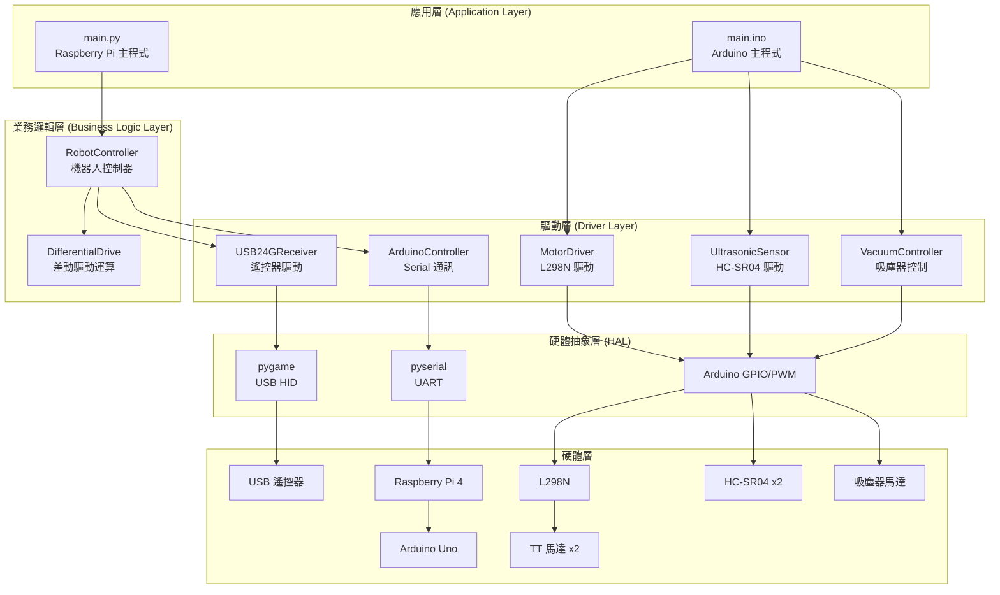
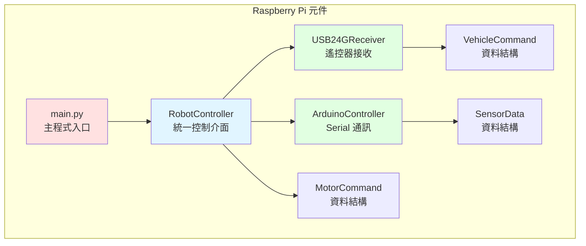
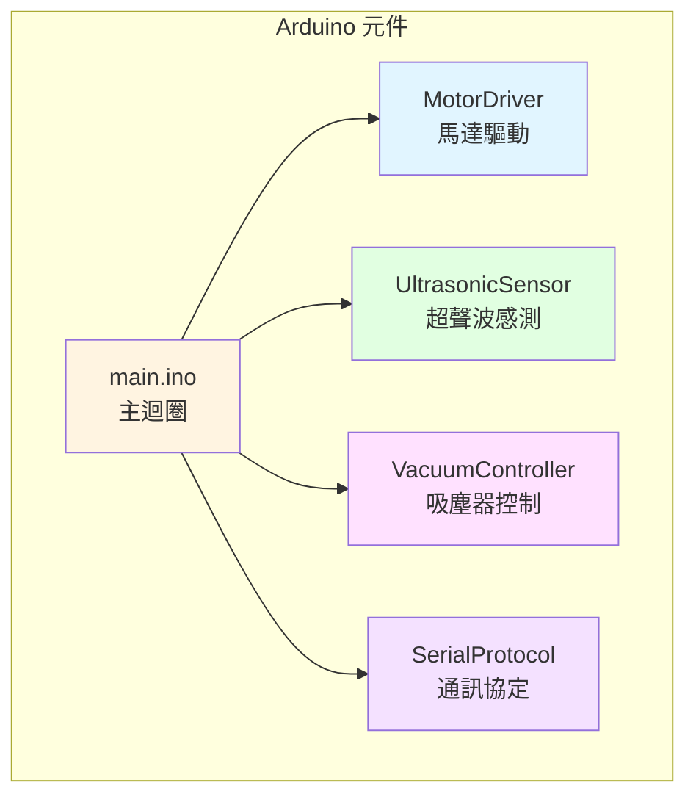
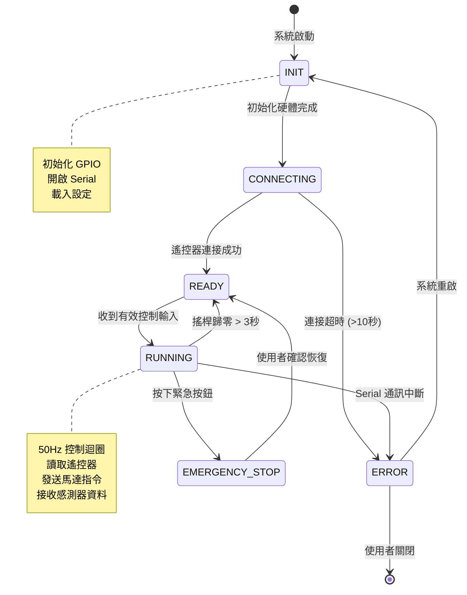

# SD - 系統設計文件
**System Design Document**

---

## 文件資訊

| 項目 | 內容 |
|------|------|
| 專案名稱 | 機電小車遙控系統 |
| 文件版本 | 1.0 |
| 建立日期 | 2025-10-31 |
| 作者 | Mechatronics Team |
| 參考文件 | 01_SRS v1.1, 02_SA v1.1 |

---

## 1. 系統架構設計

### 1.1 分層架構圖



---

### 1.2 部署架構圖

```mermaid
graph LR
    subgraph RPi["Raspberry Pi 4<br/>(Python 3.x)"]
        main_py["main.py"]
        usb_receiver["usb_24g_receiver.py"]
        arduino_controller["arduino_controller.py"]
        robot_controller["robot_controller.py"]
    end

    subgraph Arduino["Arduino Uno<br/>(C++)"]
        main_ino["main.ino"]
        motor_h["motor_driver.h"]
        sensor_h["ultrasonic_sensor.h"]
        vacuum_h["vacuum_controller.h"]
        serial_h["serial_protocol.h"]
    end

    subgraph Remote["2.4G 遙控器"]
        joystick["搖桿 + 按鈕"]
        usb_dongle["USB 接收器"]
    end

    joystick -->|2.4GHz 無線| usb_dongle
    usb_dongle -->|USB| RPi
    RPi <-->|Serial UART<br/>57600 bps| Arduino
```



---

## 2. 元件設計 (Component Design)

### 2.1 Raspberry Pi 端元件圖



---

### 2.2 Arduino 端元件圖



---

## 3. 類別設計 (Class Design)

### 3.1 Raspberry Pi 類別圖

```python
# ============================================
# VehicleCommand 資料類別
# ============================================
class VehicleCommand:
    """車輛控制指令"""
    def __init__(self):
        self.linear_velocity: float   # -1.0 ~ 1.0
        self.angular_velocity: float  # -1.0 ~ 1.0
        self.vacuum_motor: bool       # True/False
        self.mode: str                # "MANUAL" / "AUTO" / "STOP"

# ============================================
# MotorCommand 資料類別
# ============================================
class MotorCommand:
    """馬達控制指令"""
    def __init__(self):
        self.left_pwm: int    # -255 ~ 255 (int16)
        self.right_pwm: int   # -255 ~ 255 (int16)
        self.vacuum: bool     # True/False

# ============================================
# SensorData 資料類別
# ============================================
class SensorData:
    """感測器資料"""
    def __init__(self):
        self.left_distance: int   # 0 ~ 999 (uint16)
        self.right_distance: int  # 0 ~ 999 (uint16)
        self.timestamp: float     # 時間戳記

# ============================================
# USB24GReceiver 遙控器接收類別
# ============================================
class USB24GReceiver:
    """USB 2.4G 遙控器接收器"""

    def __init__(self, joystick_id=0):
        """初始化遙控器"""
        pass

    def receive(self) -> VehicleCommand:
        """接收遙控指令，返回 VehicleCommand"""
        pass

# ============================================
# ArduinoController Serial 通訊類別
# ============================================
class ArduinoController:
    """Arduino Serial 通訊控制器"""

    def __init__(self, port='/dev/ttyAMA0', baudrate=57600):
        """初始化 Serial 連接"""
        pass

    def send_motor_command(self, cmd: MotorCommand) -> bool:
        """發送馬達指令"""
        pass

    def receive_sensor_data(self) -> SensorData:
        """接收感測器資料"""
        pass

    def _build_packet(self, cmd: MotorCommand) -> bytes:
        """建構 8-byte 封包"""
        pass

    def _parse_packet(self, packet: bytes) -> SensorData:
        """解析 8-byte 封包"""
        pass

    def _calculate_checksum(self, data: bytes) -> int:
        """計算 XOR checksum"""
        pass

# ============================================
# RobotController 主控制類別
# ============================================
class RobotController:
    """機器人主控制器"""

    def __init__(self, receiver_type='2.4g'):
        """初始化控制器"""
        self.receiver: USB24GReceiver
        self.arduino: ArduinoController
        self.max_speed: int = 255

    def run(self):
        """主控制迴圈 (50Hz)"""
        pass

    def convert_to_motor_command(self, vehicle_cmd: VehicleCommand) -> MotorCommand:
        """差動驅動運算"""
        pass

    def shutdown(self):
        """關閉系統"""
        pass
```

---

### 3.2 Arduino 模組設計

```cpp
// ============================================
// MotorDriver 類別 (motor_driver.h)
// ============================================
class MotorDriver {
private:
    // L298N 腳位定義
    uint8_t in1_pin, in2_pin, ena_pin;   // 左輪
    uint8_t in3_pin, in4_pin, enb_pin;   // 右輪

public:
    MotorDriver(uint8_t in1, uint8_t in2, uint8_t ena,
                uint8_t in3, uint8_t in4, uint8_t enb);

    void begin();                           // 初始化
    void setLeftMotor(int16_t pwm);        // 設定左輪 (-255~255)
    void setRightMotor(int16_t pwm);       // 設定右輪 (-255~255)
    void stop();                            // 停止所有馬達
};

// ============================================
// UltrasonicSensor 類別 (ultrasonic_sensor.h)
// ============================================
class UltrasonicSensor {
private:
    uint8_t trig_pin;
    uint8_t echo_pin;

public:
    UltrasonicSensor(uint8_t trig, uint8_t echo);

    void begin();                           // 初始化
    uint16_t getDistance();                 // 讀取距離 (cm)

private:
    uint16_t pulseIn(uint8_t pin, uint8_t state, unsigned long timeout);
};

// ============================================
// VacuumController 類別 (vacuum_controller.h)
// ============================================
class VacuumController {
private:
    uint8_t control_pin;                    // D12
    bool current_state;

public:
    VacuumController(uint8_t pin);

    void begin();                           // 初始化
    void setState(bool state);              // 設定開關
    void toggle();                          // 切換狀態
    bool getState();                        // 取得當前狀態
};

// ============================================
// SerialProtocol 類別 (serial_protocol.h)
// ============================================
class SerialProtocol {
private:
    SoftwareSerial* serial;
    uint8_t rx_buffer[8];
    uint8_t rx_index;

public:
    SerialProtocol(SoftwareSerial* ser);

    bool receiveMotorCommand(int16_t& left_pwm, int16_t& right_pwm, bool& vacuum);
    void sendSensorData(uint16_t left_dist, uint16_t right_dist);

private:
    uint8_t calculateChecksum(uint8_t* data, uint8_t len);
    bool verifyChecksum(uint8_t* packet);
};
```

---

## 4. 模組詳細設計

### 4.1 差動驅動運算模組

```python
def convert_to_motor_command(vehicle_cmd: VehicleCommand) -> MotorCommand:
    """
    差動驅動運算

    輸入：
        linear_velocity: -1.0 ~ 1.0 (前後)
        angular_velocity: -1.0 ~ 1.0 (左右轉)

    輸出：
        left_pwm: -255 ~ 255
        right_pwm: -255 ~ 255

    公式：
        left_speed = linear_velocity - angular_velocity
        right_speed = linear_velocity + angular_velocity
    """

    # 1. 差動驅動公式
    left_speed = vehicle_cmd.linear_velocity - vehicle_cmd.angular_velocity
    right_speed = vehicle_cmd.linear_velocity + vehicle_cmd.angular_velocity

    # 2. 限制範圍 [-1.0, 1.0]
    left_speed = max(-1.0, min(1.0, left_speed))
    right_speed = max(-1.0, min(1.0, right_speed))

    # 3. 轉換為 PWM (-255 ~ 255)
    left_pwm = int(left_speed * 255)
    right_pwm = int(right_speed * 255)

    # 4. 建立指令
    cmd = MotorCommand()
    cmd.left_pwm = left_pwm
    cmd.right_pwm = right_pwm
    cmd.vacuum = vehicle_cmd.vacuum_motor

    return cmd
```

---

### 4.2 Serial 封包建構模組

```python
def build_motor_packet(left_pwm: int, right_pwm: int, vacuum: bool) -> bytes:
    """
    建構馬達控制封包 (Pi → Arduino)

    封包格式 (8 bytes):
        [0] Header: 0xAA
        [1] Left PWM Low
        [2] Left PWM High
        [3] Right PWM Low
        [4] Right PWM High
        [5] Flags (bit0 = vacuum)
        [6] Checksum (XOR of [1]-[5])
        [7] Footer: 0x55
    """
    packet = bytearray(8)

    # Header
    packet[0] = 0xAA

    # Left PWM (int16, 2's complement)
    packet[1] = left_pwm & 0xFF
    packet[2] = (left_pwm >> 8) & 0xFF

    # Right PWM (int16, 2's complement)
    packet[3] = right_pwm & 0xFF
    packet[4] = (right_pwm >> 8) & 0xFF

    # Flags
    packet[5] = 0x01 if vacuum else 0x00

    # Checksum (XOR of bytes 1-5)
    packet[6] = packet[1] ^ packet[2] ^ packet[3] ^ packet[4] ^ packet[5]

    # Footer
    packet[7] = 0x55

    return bytes(packet)
```

```cpp
// Arduino 端解析封包
bool parseMotorPacket(uint8_t* packet, int16_t& left_pwm, int16_t& right_pwm, bool& vacuum) {
    // 驗證 Header/Footer
    if (packet[0] != 0xAA || packet[7] != 0x55) {
        return false;
    }

    // 驗證 Checksum
    uint8_t checksum = packet[1] ^ packet[2] ^ packet[3] ^ packet[4] ^ packet[5];
    if (checksum != packet[6]) {
        return false;
    }

    // 解析數據 (int16, 2's complement)
    left_pwm = (int16_t)(packet[1] | (packet[2] << 8));
    right_pwm = (int16_t)(packet[3] | (packet[4] << 8));
    vacuum = (packet[5] & 0x01) != 0;

    return true;
}
```

---

### 4.3 馬達控制模組

```cpp
void MotorDriver::setLeftMotor(int16_t pwm) {
    if (pwm > 0) {
        // 前進
        digitalWrite(in1_pin, HIGH);
        digitalWrite(in2_pin, LOW);
        analogWrite(ena_pin, pwm);
    } else if (pwm < 0) {
        // 後退
        digitalWrite(in1_pin, LOW);
        digitalWrite(in2_pin, HIGH);
        analogWrite(ena_pin, -pwm);  // 絕對值
    } else {
        // 停止
        digitalWrite(in1_pin, LOW);
        digitalWrite(in2_pin, LOW);
        analogWrite(ena_pin, 0);
    }
}
```

---

### 4.4 超聲波測距模組

```cpp
uint16_t UltrasonicSensor::getDistance() {
    // 1. 發送 10μs HIGH 脈衝
    digitalWrite(trig_pin, LOW);
    delayMicroseconds(2);
    digitalWrite(trig_pin, HIGH);
    delayMicroseconds(10);
    digitalWrite(trig_pin, LOW);

    // 2. 測量 Echo 脈衝寬度 (timeout 30ms = 30000μs)
    unsigned long duration = pulseIn(echo_pin, HIGH, 30000);

    // 3. 計算距離 (聲速 340m/s = 0.034 cm/μs)
    uint16_t distance = duration * 0.034 / 2;

    // 4. 過濾無效值
    if (distance < 2 || distance > 400 || duration == 0) {
        return 999;  // 無效值
    }

    return distance;
}
```

---

## 5. 狀態機設計

### 5.1 系統狀態機



---

## 6. 檔案組織結構

### 6.1 Raspberry Pi 檔案結構

```
raspberry_pi/
├── main.py                      # 主程式入口
├── config.py                    # 設定檔
├── usb_24g_receiver.py          # 遙控器接收器
├── arduino_controller.py        # Arduino 通訊控制
├── robot_controller.py          # 機器人主控制器
├── differential_drive.py        # 差動驅動運算
├── test_joystick.py             # 遙控器測試工具
└── requirements.txt             # Python 依賴套件
```

**requirements.txt**:
```
pygame>=2.0.0
pyserial>=3.5
```

---

### 6.2 Arduino 檔案結構

```
arduino/
├── main/
│   ├── main.ino                 # 主程式
│   ├── motor_driver.h           # 馬達驅動標頭檔
│   ├── motor_driver.cpp         # 馬達驅動實作
│   ├── ultrasonic_sensor.h      # 超聲波感測器標頭檔
│   ├── ultrasonic_sensor.cpp    # 超聲波感測器實作
│   ├── vacuum_controller.h      # 吸塵器控制標頭檔
│   ├── vacuum_controller.cpp    # 吸塵器控制實作
│   ├── serial_protocol.h        # 通訊協定標頭檔
│   └── serial_protocol.cpp      # 通訊協定實作
└── README.md                    # Arduino 編譯說明
```

**依賴函式庫**:
- SoftwareSerial (內建)

---

## 7. 錯誤處理設計

### 7.1 錯誤碼定義

| 錯誤碼 | 錯誤名稱 | 描述 | 處理方式 |
|-------|---------|------|----------|
| E001 | JOYSTICK_NOT_FOUND | 找不到遙控器 | 等待連接，10秒後進入 ERROR |
| E002 | SERIAL_OPEN_FAILED | Serial 開啟失敗 | 檢查權限，重試 3 次 |
| E003 | CHECKSUM_ERROR | Checksum 驗證失敗 | 丟棄封包，計數 +1 |
| E004 | SERIAL_TIMEOUT | Serial 通訊逾時 | 重啟 Serial，記錄錯誤 |
| E005 | MOTOR_OVERLOAD | 馬達過載 | 停止馬達，警告使用者 |

---

### 7.2 錯誤恢復策略

```python
class ErrorHandler:
    def __init__(self):
        self.error_counts = {}
        self.max_retries = 3

    def handle_error(self, error_code: str):
        if error_code == "E003":  # Checksum error
            self.error_counts["checksum"] = self.error_counts.get("checksum", 0) + 1
            if self.error_counts["checksum"] > 10:
                # 進入 ERROR 狀態
                self.enter_error_state()
            else:
                # 繼續運行，丟棄封包
                pass

        elif error_code == "E004":  # Serial timeout
            self.restart_serial()

        # ... 其他錯誤處理
```

---

## 8. 效能設計

### 8.1 時序需求

| 迴圈 | 頻率 | 週期 | 優先級 | 說明 |
|------|------|------|--------|------|
| 主控制迴圈 (Pi) | 50 Hz | 20 ms | 高 | 遙控器讀取 + 馬達控制 |
| 感測器讀取 (Arduino) | 10 Hz | 100 ms | 中 | 超聲波測距 |
| Serial 發送 (Pi) | 50 Hz | 20 ms | 高 | 馬達指令 |
| Serial 回傳 (Arduino) | 10 Hz | 100 ms | 低 | 感測器資料 |

---

### 8.2 記憶體預算

**Raspberry Pi** (4GB RAM)：
- Python 基礎：~ 20MB
- Pygame：~ 10MB
- 應用程式：< 50MB
- **總計：< 100MB**（RAM 充裕）

**Arduino Uno** (2KB SRAM, 32KB Flash)：
- 全域變數：< 500 bytes
- 堆疊空間：< 500 bytes
- 函式庫：< 1000 bytes
- **總計：< 2000 bytes SRAM**（需謹慎管理）

優化建議：
- 使用 `const` 和 `PROGMEM` 將常數存於 Flash
- 避免大型陣列和字串
- 使用 `uint8_t` 替代 `int` 節省記憶體

---

## 9. 安全性設計

### 9.1 通訊安全

1. **Checksum 驗證**：所有封包包含 XOR checksum
2. **Header/Footer 驗證**：確保封包完整性
3. **逾時保護**：超過 200ms 無指令則馬達停止
4. **範圍檢查**：PWM 值限制在 -255 ~ 255

---

### 9.2 硬體保護

1. **電流保護**：建議 L298N 加裝保險絲
2. **反向電動勢保護**：吸塵器馬達加二極體
3. **電源隔離**：馬達電源與邏輯電源分離
4. **共地連接**：所有 GND 必須連接

---

## 10. 參考資料

- [01_SRS_軟體需求規格書.md](01_SRS_軟體需求規格書.md) v1.1
- [02_SA_系統分析.md](02_SA_系統分析.md) v1.1
- [SYSTEM_ARCHITECTURE.md](../SYSTEM_ARCHITECTURE.md)
- Python pygame 文件：https://www.pygame.org/docs/
- Arduino SoftwareSerial 文件：https://www.arduino.cc/reference/en/libraries/softwareserial/

---

**文件結束**
