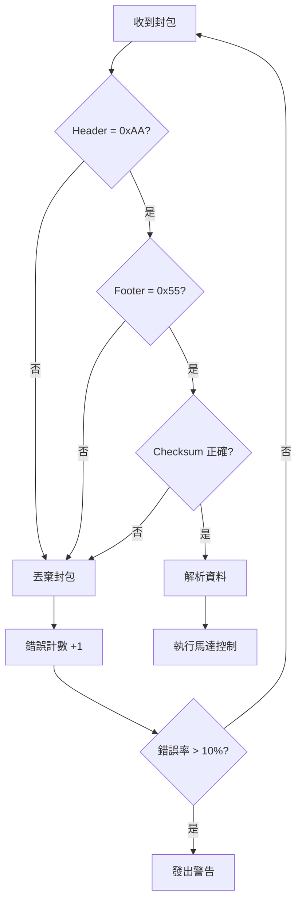
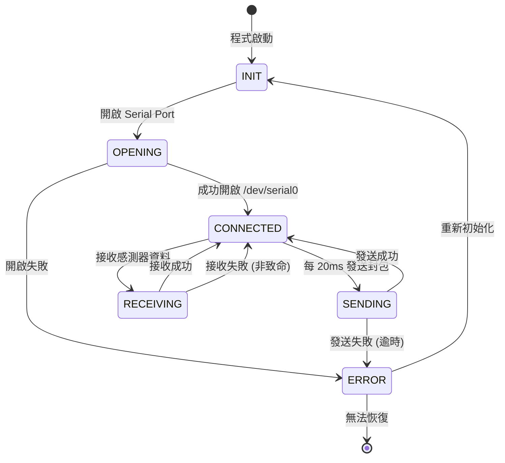
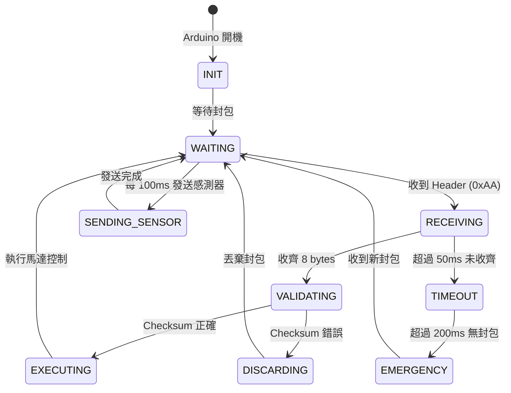
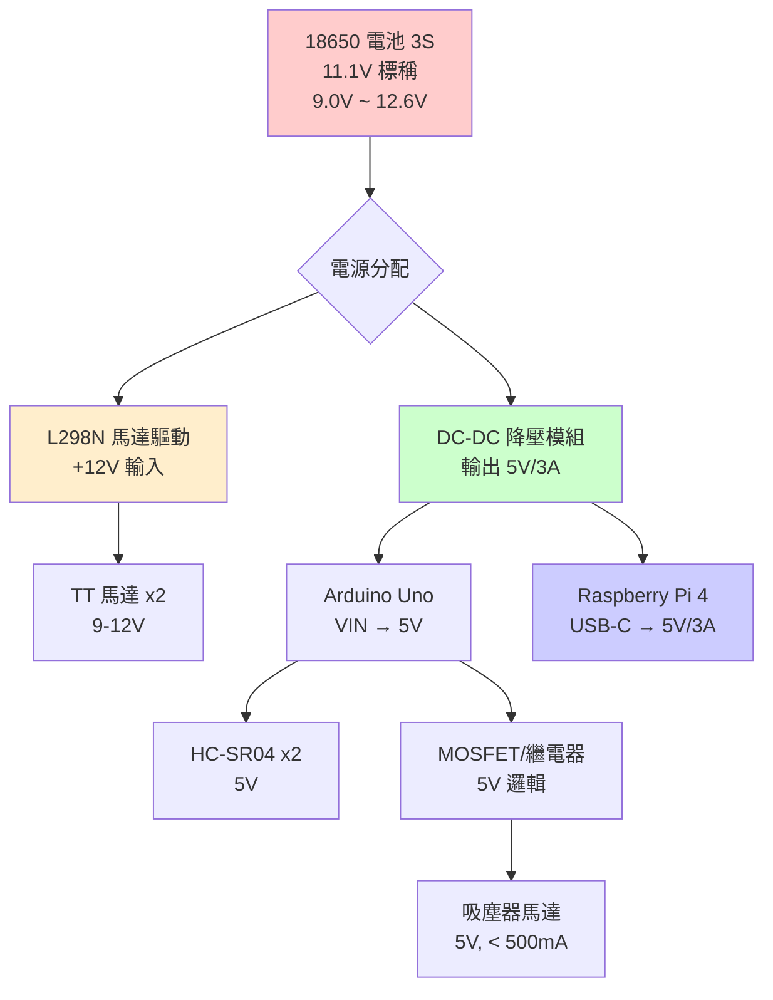
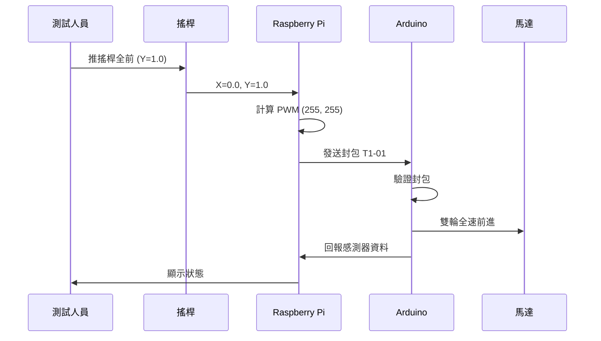

# ICD - 介面控制文件
**Interface Control Document**

---

## 文件資訊

| 項目 | 內容 |
|------|------|
| 專案名稱 | 機電小車遙控系統 |
| 文件版本 | 2.0 |
| 建立日期 | 2025-10-31 |
| 最後更新 | 2025-11-29 |
| 作者 | Mechatronics Team |
| 硬體平台 | Raspberry Pi 4 + Arduino Uno |

**修訂歷史**：
- v2.0 (2025-11-29): 新增 MPU6050 IMU 支援，感測器封包擴展為 12 bytes，新增 Yaw/GyroZ 資料
- v1.1 (2025-11-28): 更新通訊方式為 USB Serial，新增 ultrasonic_enable flag，超聲波配置改為 FRONT/RIGHT
- v1.0 (2025-10-31): 初始版本

---

## 1. 文件目的

本文件定義機電小車遙控系統中所有硬體與軟體介面的詳細規格，包括：

- **Serial 通訊協定**：Raspberry Pi ↔ Arduino 的二進位通訊格式
- **硬體接腳定義**：Arduino 和 Raspberry Pi 的 GPIO 腳位分配
- **電氣特性**：電壓、電流、時序要求
- **通訊時序**：封包傳輸時間與頻率限制
- **測試向量**：用於驗證介面正確性的範例資料

---

## 2. Serial 通訊介面

### 2.1 通訊參數

| 參數 | 數值 | 說明 |
|------|------|------|
| 傳輸速率 | 9600 bps | 鮑率 |
| 資料位元 | 8 bits | 資料長度 |
| 同位元 | None | 無同位元檢查 |
| 停止位元 | 1 bit | 停止位元數 |
| 流量控制 | None | 無硬體流控 |
| 封包大小 | 8 bytes | 固定封包長度 |
| 最大頻率 | 50 Hz | 每秒最多 50 次傳輸 |

**連接方式**：

```
Raspberry Pi USB ──────────── Arduino USB (硬體 Serial via USB)
Raspberry Pi GND ──────────── Arduino GND (共地，透過 USB)
```

> **注意**：目前使用 USB Serial 連接，不再使用 GPIO UART。
> 裝置路徑：`/dev/ttyUSB0` 或 `/dev/ttyACM0`

**⚠️ 注意事項**：
- Raspberry Pi GPIO 為 3.3V 邏輯，Arduino 為 5V 邏輯
- 因 Pi → Arduino 方向，3.3V 可被 Arduino 辨識為 HIGH（> 2.0V）
- Arduino → Pi 方向，5V 會超過 Pi 的最大輸入電壓
- **建議**：在 Arduino TX 與 Pi RX 之間加裝電阻分壓（10kΩ + 20kΩ）或使用邏輯電平轉換器

**電阻分壓電路**：

```
Arduino D2 (TX) ──┬── 10kΩ ──┬── Pi GPIO15 (RXD)
                  │           │
                  └─ 20kΩ ────┴── GND

// 輸出電壓 = 5V × 20kΩ/(10kΩ+20kΩ) = 3.33V
```

---

### 2.2 Pi → Arduino 指令封包 (Motor Command Packet)

#### 2.2.1 封包格式

| Byte 索引 | 欄位名稱 | 資料型別 | 範圍 | 說明 |
|-----------|---------|---------|------|------|
| 0 | Header | uint8 | 0xAA | 封包起始標記 |
| 1 | Left PWM Low | uint8 | 0x00 ~ 0xFF | 左輪 PWM 低位元組 |
| 2 | Left PWM High | uint8 | 0x00 ~ 0xFF | 左輪 PWM 高位元組 |
| 3 | Right PWM Low | uint8 | 0x00 ~ 0xFF | 右輪 PWM 低位元組 |
| 4 | Right PWM High | uint8 | 0x00 ~ 0xFF | 右輪 PWM 高位元組 |
| 5 | Flags | uint8 | 0x00 ~ 0xFF | 控制旗標 |
| 6 | Checksum | uint8 | 0x00 ~ 0xFF | 校驗和 (XOR) |
| 7 | Footer | uint8 | 0x55 | 封包結束標記 |

**總計**：8 bytes

#### 2.2.2 資料編碼規則

**PWM 數值編碼 (int16, 2's Complement)**：

```python
# int16 範圍：-255 ~ +255
# 正值：前進，負值：後退，0：停止

# 編碼（Python）：
left_pwm = 127  # 前進半速
low_byte = left_pwm & 0xFF          # 0x7F
high_byte = (left_pwm >> 8) & 0xFF  # 0x00

left_pwm = -100  # 後退
# int16 的 2's complement 表示：-100 = 0xFF9C
low_byte = (-100) & 0xFF            # 0x9C
high_byte = ((-100) >> 8) & 0xFF    # 0xFF
```

**解碼（Arduino C++）**：

```cpp
int16_t left_pwm = (int16_t)(packet[1] | (packet[2] << 8));
// packet[1]=0x9C, packet[2]=0xFF → 0xFF9C → -100
```

**Flags Byte 定義**：

| Bit | 名稱 | 說明 |
|-----|------|------|
| 0 | vacuum_motor | 1 = 吸塵器開啟，0 = 關閉 |
| 1 | ultrasonic_enable | 1 = 啟用超聲波讀取，0 = 停用 (遙控模式停用以減少延遲) |
| 2 | reserved | 保留 (預設 0) |
| 3 | reserved | 保留 (預設 0) |
| 4 | reserved | 保留 (預設 0) |
| 5 | reserved | 保留 (預設 0) |
| 6 | reserved | 保留 (預設 0) |
| 7 | emergency_stop | 1 = 緊急停止 (未來功能) |

**Checksum 計算**：

```python
checksum = packet[1] ^ packet[2] ^ packet[3] ^ packet[4] ^ packet[5]
```

#### 2.2.3 封包範例

**範例 1：前進全速（左右輪 PWM = 255）**

| Byte | 欄位 | 數值 (Hex) | 數值 (Dec) | 計算過程 |
|------|------|-----------|-----------|---------|
| 0 | Header | 0xAA | 170 | 固定值 |
| 1 | Left PWM Low | 0xFF | 255 | 255 & 0xFF |
| 2 | Left PWM High | 0x00 | 0 | (255 >> 8) & 0xFF |
| 3 | Right PWM Low | 0xFF | 255 | 255 & 0xFF |
| 4 | Right PWM High | 0x00 | 0 | (255 >> 8) & 0xFF |
| 5 | Flags | 0x00 | 0 | 無旗標 |
| 6 | Checksum | 0x00 | 0 | 0xFF^0x00^0xFF^0x00^0x00 |
| 7 | Footer | 0x55 | 85 | 固定值 |

**完整封包**：`AA FF 00 FF 00 00 00 55`

---

**範例 2：後退半速（左右輪 PWM = -127）**

```python
# -127 的 int16 2's complement 表示：0xFF81
# 計算：-127 = -(0x007F) = ~(0x007F) + 1 = 0xFF80 + 1 = 0xFF81
```

| Byte | 欄位 | 數值 (Hex) | 數值 (Dec) | 計算過程 |
|------|------|-----------|-----------|---------|
| 0 | Header | 0xAA | 170 | 固定值 |
| 1 | Left PWM Low | 0x81 | 129 | (-127) & 0xFF |
| 2 | Left PWM High | 0xFF | 255 | ((-127) >> 8) & 0xFF |
| 3 | Right PWM Low | 0x81 | 129 | (-127) & 0xFF |
| 4 | Right PWM High | 0xFF | 255 | ((-127) >> 8) & 0xFF |
| 5 | Flags | 0x00 | 0 | 無旗標 |
| 6 | Checksum | 0x00 | 0 | 0x81^0xFF^0x81^0xFF^0x00 |
| 7 | Footer | 0x55 | 85 | 固定值 |

**完整封包**：`AA 81 FF 81 FF 00 00 55`

---

**範例 3：左轉（左輪 0，右輪 200），吸塵器開啟**

| Byte | 欄位 | 數值 (Hex) | 數值 (Dec) | 計算過程 |
|------|------|-----------|-----------|---------|
| 0 | Header | 0xAA | 170 | 固定值 |
| 1 | Left PWM Low | 0x00 | 0 | 0 & 0xFF |
| 2 | Left PWM High | 0x00 | 0 | (0 >> 8) & 0xFF |
| 3 | Right PWM Low | 0xC8 | 200 | 200 & 0xFF |
| 4 | Right PWM High | 0x00 | 0 | (200 >> 8) & 0xFF |
| 5 | Flags | 0x01 | 1 | bit0 = 1 (吸塵器) |
| 6 | Checksum | 0xC9 | 201 | 0x00^0x00^0xC8^0x00^0x01 |
| 7 | Footer | 0x55 | 85 | 固定值 |

**完整封包**：`AA 00 00 C8 00 01 C9 55`

---

**範例 4：緊急停止（左右輪 0）**

| Byte | 欄位 | 數值 (Hex) | 數值 (Dec) | 計算過程 |
|------|------|-----------|-----------|---------|
| 0 | Header | 0xAA | 170 | 固定值 |
| 1 | Left PWM Low | 0x00 | 0 | 0 & 0xFF |
| 2 | Left PWM High | 0x00 | 0 | (0 >> 8) & 0xFF |
| 3 | Right PWM Low | 0x00 | 0 | 0 & 0xFF |
| 4 | Right PWM High | 0x00 | 0 | (0 >> 8) & 0xFF |
| 5 | Flags | 0x00 | 0 | 無旗標 |
| 6 | Checksum | 0x00 | 0 | 0x00^0x00^0x00^0x00^0x00 |
| 7 | Footer | 0x55 | 85 | 固定值 |

**完整封包**：`AA 00 00 00 00 00 00 55`

---

#### 2.2.4 封包傳輸時序

```
發送週期：20ms (50Hz)
封包大小：8 bytes
鮑率：57600 bps

單一封包傳輸時間：
= 8 bytes × 10 bits/byte (含起始/停止位元) / 57600 bps
= 80 bits / 57600 bps
= 1.39 ms

建議時序：
- 主迴圈：50Hz (20ms)
- 封包傳輸：1.4ms
- 處理時間餘裕：18.6ms
```

**時序圖**：

```
時間軸 (ms)
0      1.4   2       4       6       20     21.4   22
|──────|─────|───────|───────|───────|──────|──────|
  TX      RX    處理   等待    等待     TX      RX
封包1   封包1          (馬達控制)    封包2   封包2
```

#### 2.2.5 錯誤處理

**Arduino 接收端應檢查**：

1. **Header 檢查**：`packet[0] == 0xAA`
2. **Footer 檢查**：`packet[7] == 0x55`
3. **Checksum 驗證**：`packet[6] == (packet[1] ^ packet[2] ^ packet[3] ^ packet[4] ^ packet[5])`
4. **逾時保護**：超過 200ms 未收到封包 → 緊急停止

**錯誤處理流程**：



---

### 2.3 Arduino → Pi 感測器封包 (Sensor Data Packet)

#### 2.3.1 封包格式 (v2.0 - 12 bytes)

| Byte 索引 | 欄位名稱 | 資料型別 | 範圍 | 說明 |
|-----------|---------|---------|------|------|
| 0 | Header | uint8 | 0xBB | 封包起始標記 |
| 1 | Front Dist Low | uint8 | 0x00 ~ 0xFF | 前方距離低位元組 |
| 2 | Front Dist High | uint8 | 0x00 ~ 0xFF | 前方距離高位元組 |
| 3 | Right Dist Low | uint8 | 0x00 ~ 0xFF | 右側距離低位元組 |
| 4 | Right Dist High | uint8 | 0x00 ~ 0xFF | 右側距離高位元組 |
| 5 | Yaw Low | uint8 | 0x00 ~ 0xFF | Yaw 角度低位元組 (int16, 0.1度) |
| 6 | Yaw High | uint8 | 0x00 ~ 0xFF | Yaw 角度高位元組 |
| 7 | GyroZ | int8 | 0x00 ~ 0xFF | Z 軸角速度 (度/秒, -128~127) |
| 8 | Status | uint8 | 0x00 ~ 0xFF | 狀態旗標 |
| 9 | Reserved | uint8 | 0x00 | 保留 |
| 10 | Checksum | uint8 | 0x00 ~ 0xFF | 校驗和 (XOR bytes 1-9) |
| 11 | Footer | uint8 | 0x66 | 封包結束標記 |

**總計**：12 bytes

#### 2.3.2 資料編碼規則

**距離數值編碼 (uint16)**：

```cpp
// uint16 範圍：0 ~ 65535 cm
// 有效範圍：2 ~ 400 cm
// 無效值：999 (表示超出範圍或錯誤)

// 編碼（Arduino C++）：
uint16_t left_distance = 235;  // cm
uint8_t low_byte = left_distance & 0xFF;          // 0xEB
uint8_t high_byte = (left_distance >> 8) & 0xFF;  // 0x00
```

**解碼（Python）**：

```python
left_distance = packet[1] | (packet[2] << 8)
# packet[1]=0xEB, packet[2]=0x00 → 0x00EB → 235
```

**Yaw 角度編碼 (int16, 0.1度單位)**：

```cpp
// Arduino 編碼
float yaw_deg = 123.4;  // 度
int16_t yaw_encoded = (int16_t)(yaw_deg * 10);  // 1234
packet[5] = yaw_encoded & 0xFF;         // 0xD2
packet[6] = (yaw_encoded >> 8) & 0xFF;  // 0x04
```

```python
# Python 解碼
yaw_raw = packet[5] | (packet[6] << 8)
if yaw_raw > 32767:
    yaw_raw -= 65536  # 處理負數
yaw_deg = yaw_raw / 10.0  # 123.4
```

**GyroZ 角速度編碼 (int8, 度/秒)**：

```cpp
// Arduino 編碼
float gyroZ = -45.3;  // 度/秒
int8_t gyroZ_encoded = (int8_t)constrain(gyroZ, -128, 127);  // -45
packet[7] = (uint8_t)gyroZ_encoded;  // 0xD3
```

**Status Byte 定義 (v2.0)**：

| Bit | 名稱 | 說明 |
|-----|------|------|
| 0 | front_sensor_valid | 1 = 前方感測器資料有效，0 = 無效 |
| 1 | right_sensor_valid | 1 = 右側感測器資料有效，0 = 無效 |
| 2 | imu_valid | 1 = IMU 資料有效，0 = 無效 (v2.0 新增) |
| 3 | vacuum_motor_status | 1 = 吸塵器運作中，0 = 關閉 |
| 4 | reserved | 保留 (預設 0) |
| 5 | reserved | 保留 (預設 0) |
| 6 | reserved | 保留 (預設 0) |
| 7 | reserved | 保留 (預設 0) |

**Checksum 計算 (v2.0)**：

```cpp
// 12-byte 封包：XOR bytes 1-9
checksum = packet[1] ^ packet[2] ^ packet[3] ^ packet[4] ^ packet[5]
         ^ packet[6] ^ packet[7] ^ packet[8] ^ packet[9];
```

#### 2.3.3 封包範例 (v2.0 - 12 bytes)

**範例 1：正常測距 + IMU（前方 120cm，右側 85cm，Yaw 45.2°，GyroZ 3°/s）**

| Byte | 欄位 | 數值 (Hex) | 數值 (Dec) | 計算過程 |
|------|------|-----------|-----------|---------|
| 0 | Header | 0xBB | 187 | 固定值 |
| 1 | Front Dist Low | 0x78 | 120 | 120 & 0xFF |
| 2 | Front Dist High | 0x00 | 0 | (120 >> 8) & 0xFF |
| 3 | Right Dist Low | 0x55 | 85 | 85 & 0xFF |
| 4 | Right Dist High | 0x00 | 0 | (85 >> 8) & 0xFF |
| 5 | Yaw Low | 0xC4 | 196 | 452 & 0xFF (45.2° × 10) |
| 6 | Yaw High | 0x01 | 1 | (452 >> 8) & 0xFF |
| 7 | GyroZ | 0x03 | 3 | 3°/s |
| 8 | Status | 0x07 | 7 | bit0=1, bit1=1, bit2=1 (全有效) |
| 9 | Reserved | 0x00 | 0 | 保留 |
| 10 | Checksum | 0xF2 | 242 | XOR bytes 1-9 |
| 11 | Footer | 0x66 | 102 | 固定值 |

**完整封包**：`BB 78 00 55 00 C4 01 03 07 00 F2 66`

---

**範例 2：前方超出範圍，IMU 有效（前方 999，右側 50cm，Yaw -30.5°）**

```cpp
// 999 = 0x03E7
// -30.5° × 10 = -305 = 0xFECF (int16 2's complement)
```

| Byte | 欄位 | 數值 (Hex) | 數值 (Dec) | 計算過程 |
|------|------|-----------|-----------|---------|
| 0 | Header | 0xBB | 187 | 固定值 |
| 1 | Front Dist Low | 0xE7 | 231 | 999 & 0xFF |
| 2 | Front Dist High | 0x03 | 3 | (999 >> 8) & 0xFF |
| 3 | Right Dist Low | 0x32 | 50 | 50 & 0xFF |
| 4 | Right Dist High | 0x00 | 0 | (50 >> 8) & 0xFF |
| 5 | Yaw Low | 0xCF | 207 | -305 & 0xFF |
| 6 | Yaw High | 0xFE | 254 | (-305 >> 8) & 0xFF |
| 7 | GyroZ | 0x00 | 0 | 0°/s (靜止) |
| 8 | Status | 0x06 | 6 | bit1=1 (右有效), bit2=1 (IMU有效) |
| 9 | Reserved | 0x00 | 0 | 保留 |
| 10 | Checksum | 0x0B | 11 | XOR bytes 1-9 |
| 11 | Footer | 0x66 | 102 | 固定值 |

**完整封包**：`BB E7 03 32 00 CF FE 00 06 00 0B 66`

---

#### 2.3.4 封包傳輸時序

```
發送週期：100ms (10Hz)
封包大小：8 bytes
鮑率：57600 bps

單一封包傳輸時間：1.39 ms（同馬達指令封包）

超聲波測距時間：
- 單次測距：2-30ms（視距離而定）
- 最遠距離 400cm → 回聲時間 = 400×2/0.034 = 23529 μs ≈ 24ms
- 雙側測距（序列）：24ms × 2 = 48ms
- 加上處理時間：~50ms

建議時序：
- 超聲波測距：50ms
- 封包傳輸：1.4ms
- 總週期：100ms (10Hz)
```

**時序圖**：

```
時間軸 (ms)
0   24   48   50  51.4  100  124  148  150  151.4
|────|────|────|────|────|────|────|────|────|
 左側  右側  處理  TX   等待  左側  右側  處理  TX
測距  測距        封包        測距  測距        封包
```

---

### 2.4 通訊狀態機

#### 2.4.1 Raspberry Pi 發送端狀態機



#### 2.4.2 Arduino 接收端狀態機



---

## 3. 硬體接腳定義

### 3.1 Arduino Uno 腳位分配

#### 3.1.1 數位腳位 (Digital Pins)

| Arduino 腳位 | 功能 | 連接對象 | 方向 | PWM | 說明 |
|-------------|------|---------|------|-----|------|
| D0 | RX (保留) | - | - | ✗ | 保留給 USB Serial（除錯用） |
| D1 | TX (保留) | - | - | ✗ | 保留給 USB Serial（除錯用） |
| D2 | Serial TX | Pi GPIO15 (RXD) | OUT | ✗ | SoftwareSerial 發送 |
| D3 | L298N ENA | L298N ENA | OUT | ✓ | 左輪 PWM 速度控制 |
| D4 | Serial RX | Pi GPIO14 (TXD) | IN | ✗ | SoftwareSerial 接收 |
| D5 | L298N IN1 | L298N IN1 | OUT | ✗ | 左輪方向 A |
| D6 | L298N IN2 | L298N IN2 | OUT | ✗ | 左輪方向 B |
| D7 | Ultrasonic F Trig | HC-SR04 #1 Trig | OUT | ✗ | 前方超聲波觸發 |
| D8 | Ultrasonic F Echo | HC-SR04 #1 Echo | IN | ✗ | 前方超聲波回波 |
| D9 | L298N IN3 | L298N IN3 | OUT | ✗ | 右輪方向 A |
| D10 | L298N IN4 | L298N IN4 | OUT | ✗ | 右輪方向 B |
| D11 | L298N ENB | L298N ENB | OUT | ✓ | 右輪 PWM 速度控制 |
| D12 | Vacuum Motor | MOSFET Gate | OUT | ✗ | 吸塵器馬達開關 |
| D13 | Status LED | 板載 LED | OUT | ✗ | 狀態指示（可選） |

#### 3.1.2 類比腳位 (Analog Pins)

| Arduino 腳位 | 功能 | 連接對象 | 方向 | 說明 |
|-------------|------|---------|------|------|
| A0 | (保留) | - | - | 保留（未來電池電壓偵測） |
| A1 | Ultrasonic R Trig | HC-SR04 #2 Trig | OUT | 右側超聲波觸發 |
| A2 | Ultrasonic R Echo | HC-SR04 #2 Echo | IN | 右側超聲波回波 |
| A3 | Vacuum Motor | Relay / MOSFET | OUT | 吸塵器繼電器控制 |
| A4 | I2C SDA | MPU6050 SDA | I/O | IMU 資料線 (v2.0) |
| A5 | I2C SCL | MPU6050 SCL | OUT | IMU 時脈線 (v2.0) |

#### 3.1.3 電源腳位

| Arduino 腳位 | 電壓 | 連接對象 | 說明 |
|-------------|------|---------|------|
| 5V | 5.0V | HC-SR04 VCC | 超聲波電源 |
| 3.3V | 3.3V | - | 保留 |
| GND | 0V | 系統共地 | **必須連接所有 GND** |
| VIN | 7-12V | DC-DC 降壓模組 | 5V 輸入 |

---

### 3.2 Raspberry Pi 4 GPIO 腳位分配

#### 3.2.1 GPIO 腳位表

| BCM 編號 | 物理腳位 | 功能 | 連接對象 | 方向 | 說明 |
|---------|---------|------|---------|------|------|
| GPIO14 | Pin 8 | UART TXD | Arduino D4 (RX) | OUT | Serial 發送 |
| GPIO15 | Pin 10 | UART RXD | Arduino D2 (TX) | IN | Serial 接收 |
| GPIO2 | Pin 3 | I2C SDA | - | - | 保留（未來 IMU） |
| GPIO3 | Pin 5 | I2C SCL | - | - | 保留（未來 IMU） |
| GPIO4 | Pin 7 | (保留) | - | - | 保留 |
| GND | Pin 6, 9, 14, 20... | 接地 | 系統共地 | - | **必須連接 Arduino GND** |
| 5V | Pin 2, 4 | 電源輸出 | - | - | **不建議直接使用** |

**⚠️ 重要注意事項**：

1. **電壓保護**：
   - Pi GPIO 最大輸入電壓：3.3V
   - Arduino TX 輸出：5V
   - **必須加裝電壓分壓電路**（參見 2.1 節）

2. **共地連接**：
   - Pi GND 和 Arduino GND 必須連接
   - 所有電源模組 GND 必須連接（L298N、降壓模組、電池）

3. **Serial 設定**：
   - 需在 `/boot/config.txt` 啟用 UART：
     ```
     enable_uart=1
     dtoverlay=disable-bt
     ```
   - 重新開機後可使用 `/dev/serial0`

---

### 3.3 L298N 馬達驅動模組接腳

#### 3.3.1 輸入端（控制信號）

| L298N 腳位 | Arduino 腳位 | 信號類型 | 說明 |
|-----------|-------------|---------|------|
| IN1 | D5 | Digital | 左輪方向控制 A |
| IN2 | D6 | Digital | 左輪方向控制 B |
| IN3 | D9 | Digital | 右輪方向控制 A |
| IN4 | D10 | Digital | 右輪方向控制 B |
| ENA | D3 | PWM | 左輪速度控制（0-255） |
| ENB | D11 | PWM | 右輪速度控制（0-255） |
| GND | Arduino GND | Ground | 控制信號共地 |

**⚠️ Jumper 設定**：
- ENA/ENB 的跳線帽**必須拔除**
- 否則無法透過 Arduino 控制速度（固定全速）

#### 3.3.2 輸出端（馬達連接）

| L298N 腳位 | 連接對象 | 說明 |
|-----------|---------|------|
| OUT1 | 左輪馬達 + | 左輪馬達正極 |
| OUT2 | 左輪馬達 - | 左輪馬達負極 |
| OUT3 | 右輪馬達 + | 右輪馬達正極 |
| OUT4 | 右輪馬達 - | 右輪馬達負極 |

**馬達方向對照表**：

| IN1 | IN2 | 結果 |
|-----|-----|------|
| HIGH | LOW | 前進 |
| LOW | HIGH | 後退 |
| LOW | LOW | 停止（快速剎車） |
| HIGH | HIGH | 停止（快速剎車，不建議） |

#### 3.3.3 電源端

| L298N 腳位 | 連接對象 | 電壓 | 電流 | 說明 |
|-----------|---------|------|------|------|
| +12V | 電池正極 | 9-12V | - | 馬達電源輸入 |
| GND | 電池負極 | 0V | - | 電源共地 |
| +5V (輸出) | - | 5V | < 500mA | 板載 5V 輸出（不建議使用） |

**⚠️ 電源注意事項**：
- 電池電壓範圍：9-12V（3S 18650 = 11.1V 標稱）
- 最大電流：2A per channel
- 不建議使用 L298N 的 5V 輸出供電給 Arduino（效率低、發熱）

---

### 3.4 HC-SR04 超聲波感測器接腳

#### 3.4.1 前方感測器 (HC-SR04 #1)

| HC-SR04 腳位 | Arduino 腳位 | 信號類型 | 說明 |
|-------------|-------------|---------|------|
| VCC | 5V | Power | 電源正極 (5V) |
| Trig | D7 | Digital OUT | 觸發信號（10μs 脈衝） |
| Echo | D8 | Digital IN | 回波信號（脈寬 = 距離） |
| GND | GND | Ground | 接地 |

#### 3.4.2 右側感測器 (HC-SR04 #2)

| HC-SR04 腳位 | Arduino 腳位 | 信號類型 | 說明 |
|-------------|-------------|---------|------|
| VCC | 5V | Power | 電源正極 (5V) |
| Trig | A1 | Digital OUT | 觸發信號（10μs 脈衝） |
| Echo | A2 | Digital IN | 回波信號（脈寬 = 距離） |
| GND | GND | Ground | 接地 |

#### 3.4.3 測距時序

```
時序圖：

Trig: ___┌──────┐________________________________
         │ 10μs │
         └──────┘

Echo: ________┌──────────────────────┐___________
              │ 脈寬 = 距離 × 58μs/cm │
              └──────────────────────┘

範例：距離 100cm
脈寬 = 100 × 58 = 5800μs = 5.8ms

計算公式：
distance_cm = pulse_duration_us * 0.034 / 2
           = 5800 * 0.034 / 2
           = 98.6 cm
```

**測距步驟**：

1. 發送 10μs HIGH 脈衝到 Trig
2. 等待 Echo 變 HIGH（最長等待 30ms）
3. 測量 Echo HIGH 持續時間（使用 `pulseIn()`）
4. 計算距離：`distance_cm = duration_us * 0.034 / 2`
5. 判斷有效性：
   - duration = 0 → 999 (逾時)
   - distance < 2cm → 999 (太近)
   - distance > 400cm → 999 (太遠)

---

### 3.5 吸塵器馬達控制電路

#### 3.5.1 MOSFET 驅動電路（建議方案）

```
Arduino D12 (5V) ───┬── 10kΩ ──┬── MOSFET Gate (N-Channel)
                    │          │
                    └─ 10kΩ ───┴── GND (Pull-down)

電源 5V ────┬────────────────────┬── Vacuum Motor (+)
           │                    │
           └─ 二極體 (1N4007) ──┘  (Flyback protection)
              Cathode → Anode

MOSFET Drain ────────────────── Vacuum Motor (-)

MOSFET Source ──────────────── GND
```

**元件規格**：
- **MOSFET**：N-Channel，例如 IRLZ44N、2N7000
  - VDS > 20V
  - ID > 1A
  - VGS(th) < 3V（邏輯電平 MOSFET）
- **二極體**：1N4007 或 1N5819（Schottky，壓降更低）
  - 用途：保護 MOSFET 免受反向電動勢損壞
- **電阻**：10kΩ Pull-down（防止浮接）

#### 3.5.2 繼電器方案（備案）

```
Arduino D12 ────┬── 1kΩ ──┬── NPN 電晶體 Base (2N2222)
                │         │
                └─ 10kΩ ──┴── GND

電晶體 Collector ────────── 繼電器線圈 (一端)
電晶體 Emitter ──────────── GND

電源 5V ────┬──────────────┬── 繼電器線圈 (另一端)
           │              │
           └─ 二極體 ──────┘  (Flyback protection)

繼電器 COM ──────────────── 電源 5V
繼電器 NO ───────────────── Vacuum Motor (+)
Vacuum Motor (-) ────────── GND
```

**元件規格**：
- **繼電器**：5V 單刀單擲（SPST），額定電流 > 1A
- **電晶體**：NPN，例如 2N2222、BC547
- **二極體**：1N4007

---

### 3.6 電源分配架構



**電源規格表**：

| 模組 | 電壓 | 電流 | 功率 | 供電來源 |
|------|------|------|------|---------|
| L298N 馬達驅動 | 11.1V | < 2A × 2 | < 44W | 電池直供 |
| Raspberry Pi 4 | 5.0V | < 3A | < 15W | DC-DC 降壓 |
| Arduino Uno | 5.0V | < 500mA | < 2.5W | DC-DC 降壓 |
| HC-SR04 × 2 | 5.0V | < 30mA | < 0.15W | Arduino 5V |
| 吸塵器馬達 | 5.0V | < 500mA | < 2.5W | Arduino 5V (透過 MOSFET) |
| **總計** | - | < 7.5A | < 65W | 18650 電池 (11.1V) |

**電池續航估算**：

```
電池容量：2200mAh × 3 = 2200mAh @ 11.1V
總功率：65W（最大負載）
平均電流：65W / 11.1V = 5.86A

理論續航時間 = 2200mAh / 5860mA = 0.375 小時 = 22.5 分鐘（全負載）
實際續航時間（輕載）：約 45-60 分鐘
```

---

## 4. 電氣特性

### 4.1 電壓電平

| 信號 | 邏輯 HIGH | 邏輯 LOW | 說明 |
|------|----------|---------|------|
| Arduino GPIO | 5.0V ± 0.5V | 0V | 5V CMOS |
| Raspberry Pi GPIO | 3.3V ± 0.3V | 0V | 3.3V CMOS |
| L298N 輸入 | > 2.3V | < 0.8V | TTL 相容 |
| HC-SR04 Echo | 5.0V | 0V | 5V CMOS |

**⚠️ 電平轉換**：
- Arduino TX (5V) → Pi RX (3.3V)：**需要電阻分壓**
- Pi TX (3.3V) → Arduino RX (5V)：**可直接連接**（3.3V > 2.0V）

---

### 4.2 PWM 特性

| Arduino 腳位 | 預設頻率 | 解析度 | 範圍 | 說明 |
|-------------|---------|-------|------|------|
| D3 (ENA) | 490 Hz | 8-bit | 0-255 | 左輪速度 |
| D11 (ENB) | 490 Hz | 8-bit | 0-255 | 右輪速度 |

**頻率調整**（選配）：

```cpp
// 提升 PWM 頻率至 31.25 kHz（減少馬達噪音）
// Timer2 (D3, D11)
TCCR2B = TCCR2B & 0b11111000 | 0x01;  // 31.25 kHz
```

---

### 4.3 電流限制

| 模組 | 最大電流 | 保護措施 |
|------|---------|---------|
| Arduino 5V pin | 500mA | 自動復位保險絲 |
| Arduino GPIO | 40mA | 無硬體保護（需軟體限制） |
| L298N per channel | 2A | 熱關斷保護 |
| Raspberry Pi GPIO | 16mA | 無硬體保護 |
| Pi 5V pin (total) | 3A | USB-C 電源管理 |

---

### 4.4 上拉/下拉電阻

| 信號 | 配置 | 阻值 | 說明 |
|------|-----|------|------|
| Serial RX (Arduino D4) | Internal Pull-up | 20-50kΩ | Arduino 內建 |
| MOSFET Gate (D12) | External Pull-down | 10kΩ | 防止浮接誤觸發 |
| HC-SR04 Echo | None | - | 推挽輸出，不需上拉 |

---

## 5. 測試向量

### 5.1 馬達指令封包測試集

#### 測試案例 1：基本前進/後退

| 測試編號 | Left PWM | Right PWM | Vacuum | 完整封包 (Hex) | 預期行為 |
|---------|---------|-----------|--------|---------------|---------|
| T1-01 | 255 | 255 | 0 | `AA FF 00 FF 00 00 00 55` | 全速前進 |
| T1-02 | 127 | 127 | 0 | `AA 7F 00 7F 00 00 00 55` | 半速前進 |
| T1-03 | -255 | -255 | 0 | `AA 01 FF 01 FF 00 FE 55` | 全速後退 |
| T1-04 | -127 | -127 | 0 | `AA 81 FF 81 FF 00 00 55` | 半速後退 |
| T1-05 | 0 | 0 | 0 | `AA 00 00 00 00 00 00 55` | 停止 |

#### 測試案例 2：轉向控制

| 測試編號 | Left PWM | Right PWM | Vacuum | 完整封包 (Hex) | 預期行為 |
|---------|---------|-----------|--------|---------------|---------|
| T2-01 | 0 | 255 | 0 | `AA 00 00 FF 00 00 FF 55` | 原地左轉 |
| T2-02 | 255 | 0 | 0 | `AA FF 00 00 00 00 FF 55` | 原地右轉 |
| T2-03 | 127 | 255 | 0 | `AA 7F 00 FF 00 00 80 55` | 前進同時右轉 |
| T2-04 | 255 | 127 | 0 | `AA FF 00 7F 00 00 80 55` | 前進同時左轉 |

#### 測試案例 3：吸塵器控制

| 測試編號 | Left PWM | Right PWM | Vacuum | 完整封包 (Hex) | 預期行為 |
|---------|---------|-----------|--------|---------------|---------|
| T3-01 | 0 | 0 | 1 | `AA 00 00 00 00 01 01 55` | 靜止，吸塵器開啟 |
| T3-02 | 127 | 127 | 1 | `AA 7F 00 7F 00 01 01 55` | 半速前進，吸塵器開啟 |
| T3-03 | 255 | 255 | 1 | `AA FF 00 FF 00 01 01 55` | 全速前進，吸塵器開啟 |

#### 測試案例 4：錯誤處理

| 測試編號 | 封包 (Hex) | 錯誤類型 | 預期行為 |
|---------|-----------|---------|---------|
| T4-01 | `BB FF 00 FF 00 00 00 55` | Header 錯誤 (0xBB) | 丟棄封包 |
| T4-02 | `AA FF 00 FF 00 00 00 66` | Footer 錯誤 (0x66) | 丟棄封包 |
| T4-03 | `AA FF 00 FF 00 00 FF 55` | Checksum 錯誤 | 丟棄封包 |
| T4-04 | `AA FF` (逾時) | 封包不完整 | 逾時丟棄 |

---

### 5.2 感測器封包測試集

#### 測試案例 5：正常測距

| 測試編號 | Left Dist | Right Dist | Status | 完整封包 (Hex) | 預期解析 |
|---------|----------|-----------|--------|---------------|---------|
| T5-01 | 100 | 100 | 0x03 | `BB 64 00 64 00 03 06 66` | 雙側 100cm |
| T5-02 | 50 | 200 | 0x03 | `BB 32 00 C8 00 03 FB 66` | 左 50cm，右 200cm |
| T5-03 | 2 | 400 | 0x03 | `BB 02 00 90 01 03 90 66` | 左 2cm，右 400cm |

#### 測試案例 6：無效測距

| 測試編號 | Left Dist | Right Dist | Status | 完整封包 (Hex) | 預期解析 |
|---------|----------|-----------|--------|---------------|---------|
| T6-01 | 999 | 100 | 0x02 | `BB E7 03 64 00 02 84 66` | 左側無效，右 100cm |
| T6-02 | 100 | 999 | 0x01 | `BB 64 00 E7 03 01 85 66` | 左 100cm，右側無效 |
| T6-03 | 999 | 999 | 0x00 | `BB E7 03 E7 03 00 07 66` | 雙側無效 |

---

### 5.3 端對端整合測試

#### 測試流程



#### 測試檢查表

| 測試項目 | 輸入 | 預期輸出 | 通過標準 |
|---------|------|---------|---------|
| 搖桿前進 | Y=1.0 | 雙輪 PWM=255 | 車輛直線前進 |
| 搖桿後退 | Y=-1.0 | 雙輪 PWM=-255 | 車輛直線後退 |
| 搖桿左轉 | X=-1.0 | 左輪=0, 右輪=255 | 車輛原地左轉 |
| 搖桿右轉 | X=1.0 | 左輪=255, 右輪=0 | 車輛原地右轉 |
| 按鈕開啟 | Button=1 | Vacuum=1 | 聽到吸塵器運轉聲 |
| 按鈕關閉 | Button=0 | Vacuum=0 | 吸塵器停止 |
| 左側感測器 | 障礙物 @ 20cm | Left Dist=20±2 | 誤差 < 10% |
| 右側感測器 | 障礙物 @ 50cm | Right Dist=50±5 | 誤差 < 10% |
| 通訊逾時 | 拔掉 Serial 線 | 馬達停止 | < 200ms 內停止 |
| 錯誤恢復 | 重新插 Serial 線 | 恢復控制 | < 5 秒內恢復 |

---

## 6. 時序需求

### 6.1 控制迴圈時序

| 階段 | 時間 (ms) | 頻率 (Hz) | 說明 |
|------|----------|----------|------|
| 搖桿讀取 | 1 | 50 | pygame 事件輪詢 |
| 差動運算 | < 0.1 | 50 | CPU 計算 |
| 封包建構 | < 0.1 | 50 | 封包組裝 |
| Serial 傳輸 | 1.39 | 50 | 8 bytes @ 57600 bps |
| Arduino 處理 | 1 | 50 | 解析 + 執行 |
| 馬達響應 | < 5 | 50 | PWM 更新 |
| **端對端延遲** | **< 10** | **50** | **搖桿 → 馬達** |

### 6.2 感測器更新時序

| 階段 | 時間 (ms) | 頻率 (Hz) | 說明 |
|------|----------|----------|------|
| 左側測距 | 2-24 | 10 | 視距離而定 |
| 右側測距 | 2-24 | 10 | 序列執行 |
| 資料過濾 | < 1 | 10 | 有效性檢查 |
| 封包傳輸 | 1.39 | 10 | 8 bytes @ 57600 bps |
| **總週期** | **50-100** | **10** | **雙側測距** |

---

## 7. 介面驗證工具

### 7.1 Python Serial 測試工具

```python
#!/usr/bin/env python3
"""serial_test.py - Serial 介面測試工具"""

import serial
import time

def test_motor_command():
    """測試馬達指令封包發送"""
    ser = serial.Serial('/dev/serial0', 57600, timeout=0.1)

    # 測試案例：全速前進
    packet = bytes([0xAA, 0xFF, 0x00, 0xFF, 0x00, 0x00, 0x00, 0x55])
    print(f"發送: {packet.hex(' ')}")
    ser.write(packet)

    time.sleep(0.1)

    # 接收感測器資料
    response = ser.read(8)
    if len(response) == 8:
        print(f"接收: {response.hex(' ')}")
        left_dist = response[1] | (response[2] << 8)
        right_dist = response[3] | (response[4] << 8)
        print(f"左側: {left_dist} cm, 右側: {right_dist} cm")

    ser.close()

if __name__ == "__main__":
    test_motor_command()
```

### 7.2 Arduino Serial 除錯工具

```cpp
// serial_debug.ino - Serial 通訊除錯工具

void setup() {
  Serial.begin(115200);  // USB Serial（除錯用）
  Serial.println("Serial Debug Tool");
}

void loop() {
  // 從 SoftwareSerial 接收封包
  if (Serial1.available() >= 8) {
    uint8_t packet[8];
    Serial1.readBytes(packet, 8);

    // 顯示原始封包
    Serial.print("RX: ");
    for (int i = 0; i < 8; i++) {
      Serial.print(packet[i], HEX);
      Serial.print(" ");
    }
    Serial.println();

    // 驗證封包
    if (packet[0] != 0xAA) {
      Serial.println("ERROR: Header mismatch");
    }
    if (packet[7] != 0x55) {
      Serial.println("ERROR: Footer mismatch");
    }

    uint8_t checksum = packet[1] ^ packet[2] ^ packet[3] ^ packet[4] ^ packet[5];
    if (checksum != packet[6]) {
      Serial.print("ERROR: Checksum mismatch (expected ");
      Serial.print(checksum, HEX);
      Serial.print(", got ");
      Serial.print(packet[6], HEX);
      Serial.println(")");
    } else {
      int16_t left_pwm = (int16_t)(packet[1] | (packet[2] << 8));
      int16_t right_pwm = (int16_t)(packet[3] | (packet[4] << 8));
      Serial.print("OK: Left=");
      Serial.print(left_pwm);
      Serial.print(", Right=");
      Serial.println(right_pwm);
    }
  }
}
```

---

## 8. 介面變更管理

### 8.1 版本控制

| 介面 | 版本 | 變更日期 | 變更說明 |
|------|------|---------|---------|
| Serial Protocol | 2.0 | 2025-11-29 | 感測器封包擴展為 12 bytes，新增 IMU 欄位 |
| Serial Protocol | 1.1 | 2025-11-28 | 新增 ultrasonic_enable flag |
| Serial Protocol | 1.0 | 2025-10-31 | 初始版本 |
| Pin Assignment | 2.0 | 2025-11-29 | A3 改為吸塵器，A4/A5 用於 MPU6050 I2C |
| Pin Assignment | 1.0 | 2025-10-31 | 初始版本 |

### 8.2 相容性矩陣

| Pi 軟體版本 | Arduino 韌體版本 | Serial 協定版本 | 相容性 |
|-----------|----------------|---------------|-------|
| 2.0 | 2.0 | 2.0 | ✅ 完全相容 (IMU 支援) |
| 2.0 | 1.x | 1.x | ❌ 不相容 (封包大小不同) |
| 1.x | 2.0 | 2.0 | ❌ 不相容 (封包大小不同) |
| 1.0 | 1.0 | 1.0 | ✅ 完全相容 (無 IMU) |

### 8.3 未來擴充計畫

**Phase 2（視覺導航）可能新增**：

1. **Camera 介面**：
   - Pi Camera 透過 CSI 排線連接
   - 使用 `picamera2` 函式庫
   - 不影響 Serial 通訊

2. **IMU 感測器（I2C）**：
   - MPU6050 連接至 Pi GPIO2/3 (I2C)
   - 提供姿態估計
   - 需新增 Status Byte 欄位

3. **備用遙控介面**：
   - Bluetooth 搖桿（已規劃）
   - Web UI（已規劃）
   - 不修改 Serial 協定

---

## 9. 參考標準

- **Serial 通訊**：RS-232 標準（簡化版）
- **PWM 信號**：IEC 61131-3
- **超聲波測距**：HC-SR04 Datasheet
- **馬達驅動**：L298N Datasheet
- **GPIO 電氣特性**：
  - Arduino: ATmega328P Datasheet
  - Raspberry Pi: BCM2711 ARM Peripherals Manual

---

## 10. 附錄

### 10.1 Checksum 計算範例

```python
# Python 版本
def calculate_checksum(data: list) -> int:
    """計算 XOR checksum (bytes 1-5)"""
    checksum = 0
    for byte in data[1:6]:  # bytes 1-5
        checksum ^= byte
    return checksum

# 範例
packet = [0xAA, 0xFF, 0x00, 0xFF, 0x00, 0x00, 0x00, 0x55]
checksum = calculate_checksum(packet)
print(f"Checksum: 0x{checksum:02X}")  # 0x00
```

```cpp
// Arduino C++ 版本
uint8_t calculate_checksum(uint8_t* packet) {
    return packet[1] ^ packet[2] ^ packet[3] ^ packet[4] ^ packet[5];
}
```

### 10.2 int16 2's Complement 對照表

| 十進位 | 十六進位 | 二進位 | 說明 |
|-------|---------|-------|------|
| 255 | 0x00FF | 0000 0000 1111 1111 | 最大正值 |
| 127 | 0x007F | 0000 0000 0111 1111 | 半速正值 |
| 1 | 0x0001 | 0000 0000 0000 0001 | 最小正值 |
| 0 | 0x0000 | 0000 0000 0000 0000 | 零 |
| -1 | 0xFFFF | 1111 1111 1111 1111 | 最小負值 |
| -127 | 0xFF81 | 1111 1111 1000 0001 | 半速負值 |
| -255 | 0xFF01 | 1111 1111 0000 0001 | 最大負值 |

### 10.3 常見問題 (FAQ)

**Q1: 為什麼 Serial 使用 57600 bps 而非 115200 bps？**
A1: SoftwareSerial 在 115200 bps 下較不穩定，57600 bps 提供更好的可靠性。

**Q2: 可以在 Arduino TX 和 Pi RX 之間不加電阻分壓嗎？**
A2: 理論上可能損壞 Pi GPIO，強烈建議加裝保護電路。

**Q3: L298N 的 5V 輸出為什麼不建議使用？**
A3: 轉換效率低（約 50%），發熱嚴重，電流有限（< 500mA）。

**Q4: 超聲波測距為什麼不能同時觸發？**
A4: 避免回波干擾，序列測距更穩定。

**Q5: 封包 Checksum 錯誤率很高怎麼辦？**
A5: 檢查共地連接、降低鮑率、加裝 EMI 濾波電容。

---

**文件結束**
