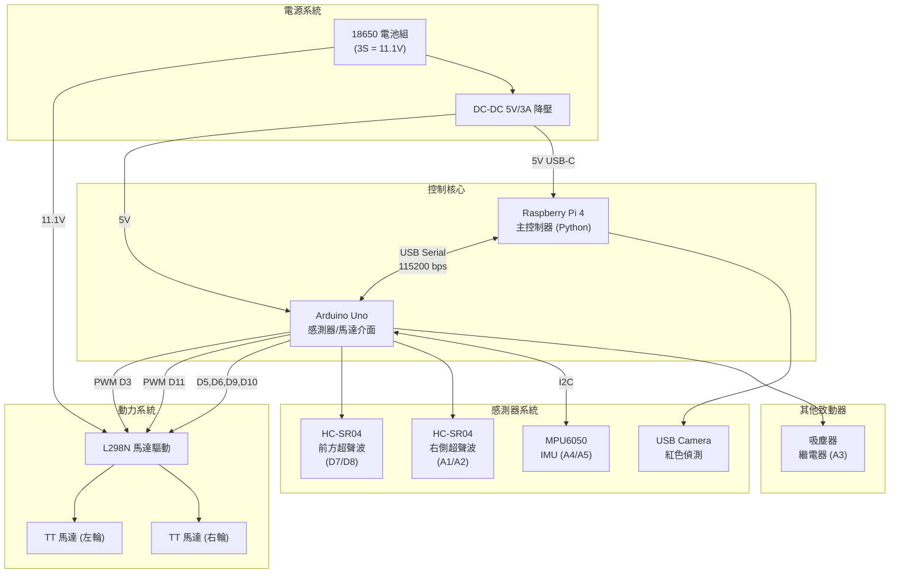
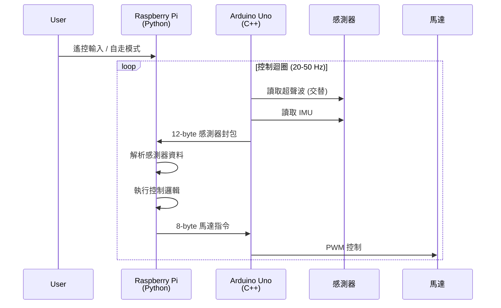

# 技術參考文檔

**專案名稱：** 機電小車自走清掃系統
**團隊：** NTU BIME 2025 機電整合四 Group 10
**文檔版本：** 2.0
**最後更新：** 2025-11-29

---

## 目錄

1. [系統概述](#1-系統概述)
2. [硬體架構](#2-硬體架構)
3. [軟體架構](#3-軟體架構)
4. [通訊協定](#4-通訊協定)
5. [控制演算法](#5-控制演算法)
6. [感測器整合](#6-感測器整合)
7. [演進歷史](#7-演進歷史)

---

## 1. 系統概述

### 1.1 系統規格

| 項目 | 規格 |
|-----|------|
| 主控制器 | Raspberry Pi 4 (Python 3.11+) |
| 微控制器 | Arduino Uno (ATmega328P) |
| 馬達驅動 | L298N H-Bridge 雙通道 |
| 驅動馬達 | TT 馬達 × 2（無編碼器，開環控制）|
| 超聲波 | HC-SR04 × 2（前方 + 右側）|
| 慣性測量 | MPU6050 6軸 IMU（Yaw 角度積分）|
| 視覺系統 | USB Camera（紅色區域偵測）|
| 通訊方式 | USB Serial 115200 bps（改自 GPIO UART）|
| 電源系統 | 18650 3S (11.1V) + DC-DC 5V/3A 降壓 |

### 1.2 功能模式

| 模式 | 入口程式 | 說明 |
|-----|---------|------|
| 遙控模式 | `main.py` | 2.4G USB 遙控器手動控制 |
| 自走模式 | `autonomous_main.py` | 沿右牆 + 紅色偵測迴避 |
| 自走（無相機）| `autonomous_main.py --no-camera` | 僅超聲波導航 |

---

## 2. 硬體架構

### 2.1 系統架構圖



### 2.2 Arduino 腳位配置

#### 數位腳位 (Digital Pins)

| 腳位 | 功能 | 連接對象 | 說明 |
|-----|------|---------|------|
| D3 | PWM 輸出 | L298N ENA | 左輪速度控制 |
| D5 | 數位輸出 | L298N IN2 | 左輪方向 B |
| D6 | 數位輸出 | L298N IN1 | 左輪方向 A |
| D7 | 數位輸出 | HC-SR04 #1 Trig | 前方超聲波觸發 |
| D8 | 數位輸入 | HC-SR04 #1 Echo | 前方超聲波回波 |
| D9 | 數位輸出 | L298N IN3 | 右輪方向 A |
| D10 | 數位輸出 | L298N IN4 | 右輪方向 B |
| D11 | PWM 輸出 | L298N ENB | 右輪速度控制 |

#### 類比腳位 (Analog Pins)

| 腳位 | 功能 | 連接對象 | 說明 |
|-----|------|---------|------|
| A1 | 數位輸出 | HC-SR04 #2 Trig | 右側超聲波觸發 |
| A2 | 數位輸入 | HC-SR04 #2 Echo | 右側超聲波回波 |
| A3 | 數位輸出 | Relay / MOSFET | 吸塵器控制 |
| A4 | I2C SDA | MPU6050 SDA | IMU 資料線 |
| A5 | I2C SCL | MPU6050 SCL | IMU 時脈線 |

### 2.3 L298N 馬達驅動器

**接線對照表：**

| L298N 腳位 | Arduino 腳位 | 功能 |
|-----------|-------------|------|
| IN1 | D6 | 左輪方向 A |
| IN2 | D5 | 左輪方向 B |
| IN3 | D9 | 右輪方向 A |
| IN4 | D10 | 右輪方向 B |
| ENA | D3 (PWM) | 左輪速度 (0-255) |
| ENB | D11 (PWM) | 右輪速度 (0-255) |
| +12V | 電池 11.1V | 馬達電源 |
| GND | Arduino GND | **共地必須** |

**重要設定：**
- ✅ 移除 ENA/ENB 跳線帽（啟用 PWM 速度控制）
- ⚠️ 所有 GND 必須連接（Arduino、L298N、Raspberry Pi）

### 2.4 超聲波感測器配置

**安裝位置演進：**
- v1.0 (期中)：左側 + 右側
- v2.0 (期末)：**前方 + 右側**（配合沿右牆策略）

| 位置 | 觸發腳 | 回波腳 | 安裝角度 | 用途 |
|-----|-------|-------|---------|------|
| 前方 | D7 | D8 | 正前方 0° | 偵測前方障礙，轉彎判斷 |
| 右側 | A1 | A2 | 側向 90° | 沿牆距離控制 |

**技術規格：**
- 偵測範圍：2-400 cm
- 更新頻率：10 Hz（每 100ms，交替讀取避免干擾）
- 超時處理：pulseIn 超時 30ms，回傳 999 表示無效

### 2.5 MPU6050 IMU 配置

**新增於 v2.0 (2025-11-29)**

| 參數 | 設定值 |
|-----|-------|
| I2C 位址 | 0x68 |
| 更新頻率 | 50 Hz (20ms) |
| Yaw 計算 | GyroZ 積分（簡化，非 DMP）|
| 漂移率 | ~0.77°/分鐘（實測）|

**用途：**
- 輔助轉彎角度估計
- 直線行駛校正
- 未來可擴展至閉環轉向控制

### 2.6 電源架構

```
18650 電池組 (3S = 9V ~ 12.6V)
    │
    ├─→ L298N +12V 輸入（馬達電源，直供）
    │
    └─→ DC-DC 降壓模組 (5V/3A 輸出)
          │
          ├─→ Arduino Uno (5V via Vin 或 USB)
          │
          └─→ Raspberry Pi 4 (5V/3A via USB-C)
```

**⚠️ 關鍵注意事項：**
1. 所有 GND 必須連接（共地）
2. Pi 4 建議獨立 5V/3A 供電（耗電較大）
3. L298N 5V 輸出可供 Arduino，但建議分離供電

---

## 3. 軟體架構

### 3.1 Raspberry Pi 程式結構

```
raspberry_pi/
├── main.py                 # 遙控模式入口
├── autonomous_main.py      # 自走模式入口（v1.1 新增）
├── config.py               # 系統參數設定
│
├── arduino_controller.py   # Arduino Serial 通訊
├── differential_drive.py   # 差動驅動演算法
├── usb_24g_receiver.py     # USB 遙控器輸入
│
├── wall_follower.py        # 沿牆控制器（v1.1 新增）
├── red_detector.py         # 紅色偵測器（v2.0 背景執行緒）
├── imu_processor.py        # IMU 資料處理（v2.0 新增）
│
├── test_joystick.py        # 遙控器測試
├── test_ultrasonic.py      # 超聲波測試
├── test_mpu6050.py         # IMU 測試
└── requirements.txt        # Python 依賴
```

### 3.2 Arduino 程式結構

```
arduino/main/
├── main.ino                # 主程式
├── config.h                # 硬體參數設定（腳位、時序）
│
├── motor_driver.h/cpp      # L298N 馬達驅動
├── ultrasonic_sensor.h/cpp # HC-SR04 超聲波
├── vacuum_controller.h/cpp # 吸塵器控制
├── mpu6050_sensor.h/cpp    # MPU6050 IMU（v2.0 新增）
└── serial_protocol.h/cpp   # Serial 通訊協定
```

### 3.3 控制流程



---

## 4. 通訊協定

### 4.1 協定版本歷史

| 版本 | 日期 | 變更 |
|-----|------|------|
| v1.0 | 2025-10-31 | 初始版本，8-byte 感測器封包 |
| v1.1 | 2025-11-28 | 新增 ultrasonic_enable flag，改 USB Serial |
| **v2.0** | **2025-11-29** | **擴展為 12-byte，新增 IMU 資料** |

### 4.2 Pi → Arduino 馬達指令封包 (8 bytes)

| Byte | 欄位 | 型別 | 範圍 | 說明 |
|------|-----|------|------|------|
| 0 | Header | uint8 | 0xAA | 封包起始 |
| 1 | Left PWM Low | uint8 | - | 左輪速度低位元 |
| 2 | Left PWM High | uint8 | - | 左輪速度高位元 |
| 3 | Right PWM Low | uint8 | - | 右輪速度低位元 |
| 4 | Right PWM High | uint8 | - | 右輪速度高位元 |
| 5 | Flags | uint8 | - | bit0=vacuum, bit1=ultrasonic_enable |
| 6 | Checksum | uint8 | - | XOR bytes 1-5 |
| 7 | Footer | uint8 | 0x55 | 封包結束 |

**PWM 編碼：** int16 小端序，範圍 -255 ~ +255

**Flags 位元定義：**
- bit0: 吸塵器開關 (1=ON, 0=OFF)
- bit1: 超聲波啟用 (1=啟用, 0=停用)

### 4.3 Arduino → Pi 感測器封包 (v2.0 - 12 bytes)

| Byte | 欄位 | 型別 | 說明 |
|------|-----|------|------|
| 0 | Header | uint8 | 0xBB |
| 1-2 | Front Distance | uint16 | 前方距離 (cm) |
| 3-4 | Right Distance | uint16 | 右側距離 (cm) |
| 5-6 | Yaw Angle | int16 | Yaw 角度 (0.1度單位) |
| 7 | GyroZ | int8 | Z 軸角速度 (度/秒) |
| 8 | Status | uint8 | 狀態位元 |
| 9 | Reserved | uint8 | 保留 (0x00) |
| 10 | Checksum | uint8 | XOR bytes 1-9 |
| 11 | Footer | uint8 | 0x66 |

**Status Byte 位元定義：**
- bit0: front_sensor_valid
- bit1: right_sensor_valid
- bit2: imu_valid (v2.0 新增)
- bit3: vacuum_motor_status

**Yaw 編碼範例：**
```cpp
// Arduino 編碼
float yaw_deg = 45.2;
int16_t yaw_encoded = (int16_t)(yaw_deg * 10);  // 452
packet[5] = yaw_encoded & 0xFF;
packet[6] = (yaw_encoded >> 8) & 0xFF;
```

```python
# Python 解碼
yaw_raw = packet[5] | (packet[6] << 8)
if yaw_raw > 32767:
    yaw_raw -= 65536  # 處理負數
yaw_deg = yaw_raw / 10.0  # 45.2
```

### 4.4 通訊時序

| 項目 | 週期 | 說明 |
|-----|------|------|
| 馬達指令發送 | 50ms (20 Hz) | Pi → Arduino |
| 感測器資料回傳 | 100ms (10 Hz) | Arduino → Pi |
| 超聲波讀取 | 50ms (交替) | 前/右交替避免干擾 |
| IMU 讀取 | 20ms (50 Hz) | Yaw 積分更新 |

---

## 5. 控制演算法

### 5.1 差動驅動 (Differential Drive)

將線速度和角速度轉換為左右輪 PWM：

```python
# 輸入
linear_velocity   # -1.0 ~ +1.0（前進/後退）
angular_velocity  # -1.0 ~ +1.0（左轉/右轉）

# 差動驅動公式
left_speed = linear_velocity - angular_velocity
right_speed = linear_velocity + angular_velocity

# 限幅
left_speed = clamp(left_speed, -1.0, 1.0)
right_speed = clamp(right_speed, -1.0, 1.0)

# 轉換為 PWM
left_pwm = int(left_speed * 255)
right_pwm = int(right_speed * 255)
```

### 5.2 沿右牆控制 (Wall Following)

**策略：** 維持與右牆固定距離，前方有障礙時左轉

```python
class WallFollower:
    TARGET_DIST = 18      # 目標距牆距離 (cm)
    TOLERANCE = 5         # 容差 (±5cm)
    FRONT_STOP = 20       # 前方停止距離
    FRONT_SLOW = 40       # 前方減速距離

    def compute(self, front_dist, right_dist, base_speed=200):
        # 1. 前方有牆 → 需要轉彎
        if front_dist < self.FRONT_STOP:
            return (0, 0, 'turn_left')

        # 2. 前方接近 → 減速
        speed = base_speed
        if front_dist < self.FRONT_SLOW:
            speed = int(base_speed * 0.6)

        # 3. 沿右牆修正
        error = right_dist - self.TARGET_DIST

        if error > self.TOLERANCE:
            # 離牆太遠 → 右偏
            return (speed, int(speed * 0.7), 'adjust_right')
        elif error < -self.TOLERANCE:
            # 離牆太近 → 左偏
            return (int(speed * 0.7), speed, 'adjust_left')
        else:
            # 距離剛好 → 直走
            return (speed, speed, 'forward')
```

### 5.3 紅色偵測與迴避

**v2.0 改進：** 使用背景執行緒，避免阻塞主控制迴圈

```python
class RedDetector:
    # HSV 紅色範圍（跨 0 和 180）
    LOWER_RED1 = np.array([0, 100, 100])
    UPPER_RED1 = np.array([10, 255, 255])
    LOWER_RED2 = np.array([160, 100, 100])
    UPPER_RED2 = np.array([180, 255, 255])

    AREA_THRESHOLD = 5000  # 最小面積閾值

    def start(self):
        """啟動背景執行緒"""
        self._running = True
        self._thread = threading.Thread(target=self._detection_loop)
        self._thread.start()

    def get_result(self):
        """非阻塞取得結果"""
        with self._lock:
            return self._result_detected, self._result_area
```

---

## 6. 感測器整合

### 6.1 超聲波交替讀取

避免同時觸發造成回波干擾：

```cpp
// Arduino main loop
static bool readFront = true;

if (currentTime - lastSensorTime >= 50) {  // 50ms
    if (readFront) {
        frontDistance = frontUltrasonic.getDistance();
    } else {
        rightDistance = rightUltrasonic.getDistance();
        sendSensorData();  // 兩個都讀完才發送
    }
    readFront = !readFront;
    lastSensorTime = currentTime;
}
```

### 6.2 MPU6050 Yaw 積分

**簡化實作（非 DMP）：**

```cpp
void updateIMU() {
    static unsigned long lastUpdate = 0;
    unsigned long now = millis();
    float dt = (now - lastUpdate) / 1000.0f;
    lastUpdate = now;

    // 讀取角速度
    int16_t gz_raw;
    Wire.beginTransmission(0x68);
    Wire.write(0x47);  // GYRO_ZOUT_H
    Wire.endTransmission();
    Wire.requestFrom(0x68, 2);
    gz_raw = (Wire.read() << 8) | Wire.read();

    // 轉換為度/秒（±250°/s 範圍）
    float gyroZ = gz_raw / 131.0f;

    // 積分得到 Yaw 角度
    yaw += gyroZ * dt;

    // 正規化到 -180 ~ 180
    while (yaw > 180) yaw -= 360;
    while (yaw < -180) yaw += 360;
}
```

### 6.3 感測器資料融合

自走模式中的決策優先順序：

1. **紅色偵測**（最高優先）：看到紅色 → 迴避
2. **前方超聲波**：距離 < 20cm → 左轉
3. **右側超聲波**：維持沿牆距離
4. **IMU Yaw**：輔助轉彎角度判斷

---

## 7. 演進歷史

### 7.1 版本時間線

```
2025-10-31  v1.0  專案啟動
    ├─ 建立基礎架構
    ├─ L298N 馬達控制
    ├─ 雙超聲波（左/右側）
    ├─ GPIO UART 通訊 (57600 bps)
    ├─ 2.4G USB 遙控器整合
    └─ 8-byte 二進位協定

2025-11-14  v1.0.1  期中測試
    ├─ 遙控模式驗證完成
    ├─ Serial 通訊穩定性修復
    ├─ 降低頻率解決 timeout
    └─ 關閉 Arduino DEBUG 輸出

2025-11-28  v1.1  期末自走準備
    ├─ 新增 autonomous_main.py
    ├─ 超聲波配置改為 前方/右側
    ├─ 通訊改為 USB Serial (115200 bps)
    ├─ 新增 ultrasonic_enable flag
    ├─ 新增 wall_follower.py
    └─ 新增紅色偵測基礎

2025-11-29  v2.0  MPU6050 整合
    ├─ 新增 MPU6050 IMU 支援
    ├─ 感測器封包擴展為 12 bytes
    ├─ 新增 Yaw/GyroZ 資料欄位
    ├─ 紅色偵測改為背景執行緒
    ├─ 新增 imu_processor.py
    └─ 更新 ICD 至 v2.0
```

### 7.2 關鍵決策演變

#### 通訊方式

| 階段 | 方式 | 鮑率 | 原因 |
|-----|------|-----|------|
| 初期設計 | GPIO UART (Pin 2,4) | 57600 | SoftwareSerial |
| v1.0.1 | GPIO UART | 9600 | 降低頻率解決 timeout |
| v1.1+ | **USB Serial** | **115200** | 更穩定、免接線 |

#### 超聲波配置

| 階段 | 位置 | 原因 |
|-----|------|------|
| v1.0 | 左側 + 右側 | 兩側防撞 |
| v1.1+ | **前方 + 右側** | 配合沿右牆策略 |

#### 遙控方案

| 階段 | 方案 | 原因 |
|-----|------|------|
| 初期設計 | NRF24L01 自製 | 學習目的 |
| v1.0+ | **USB 2.4G 遙控器** | 即插即用、省時 |

### 7.3 問題解決紀錄

#### Serial Timeout 問題 (v1.0.1)

**現象：** 程式運行約 7 秒後卡死，顯示 `Write timeout`

**原因分析：**
1. Arduino DEBUG 輸出佔用頻寬
2. 9600 baud 不足（50Hz × 8 bytes = 3200 bytes/s）
3. 發送緩衝區滿導致阻塞

**解決方案：**
```python
# 降低控制頻率
CONTROL_LOOP_FREQUENCY = 20  # 從 50Hz 降到 20Hz

# 加入 write timeout
serial.Serial(timeout=0.1, write_timeout=0.1)
```

```cpp
// 關閉 Arduino DEBUG 輸出
// #define DEBUG_SERIAL_ENABLED
```

#### 超聲波阻塞問題

**現象：** pulseIn() 最多阻塞 30ms，兩個感測器共 60ms

**解決方案：** 交替讀取
```cpp
// 每 50ms 只讀取一個感測器
if (readFront) {
    frontDistance = frontUltrasonic.getDistance();
} else {
    rightDistance = rightUltrasonic.getDistance();
}
readFront = !readFront;
```

#### IMU 資料無效問題 (v2.0)

**現象：** Pi 端收到的 IMU 資料一直無效

**原因：** Arduino 開機訊息干擾封包同步

**解決方案：**
```python
def _sync_to_packet(self):
    """同步到有效封包起始"""
    while True:
        byte = self.serial.read(1)
        if byte == b'\xbb':
            remaining = self.serial.read(11)
            if len(remaining) == 11 and remaining[-1] == 0x66:
                return b'\xbb' + remaining
```

---

## 附錄

### A. 參考文檔

- [04_ICD_介面規格.md](docs/04_ICD_介面規格.md) - 完整通訊協定規格
- [MIDTERM_REPORT.md](MIDTERM_REPORT.md) - 期中報告
- [FINAL_AUTONOMOUS_PLAN.md](FINAL_AUTONOMOUS_PLAN.md) - 期末競賽計畫

### B. 外部資源

- [L298N 資料手冊](https://www.st.com/resource/en/datasheet/l298.pdf)
- [HC-SR04 超聲波模組](https://cdn.sparkfun.com/datasheets/Sensors/Proximity/HCSR04.pdf)
- [MPU6050 寄存器表](https://invensense.tdk.com/wp-content/uploads/2015/02/MPU-6000-Register-Map1.pdf)

---

**文檔維護者：** Mechatronics Team
**最後更新：** 2025-11-29
