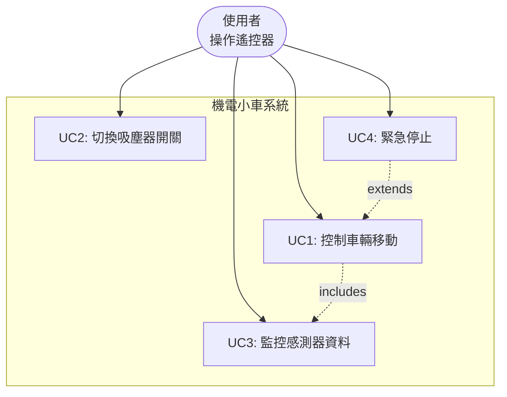
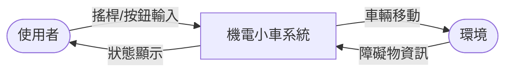
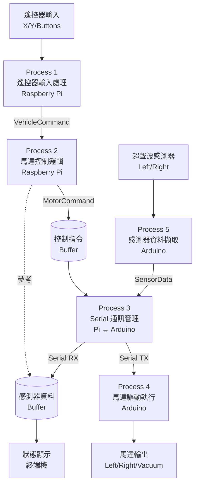
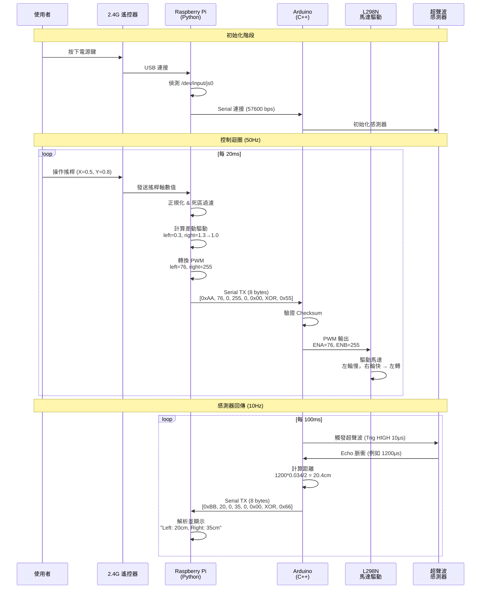
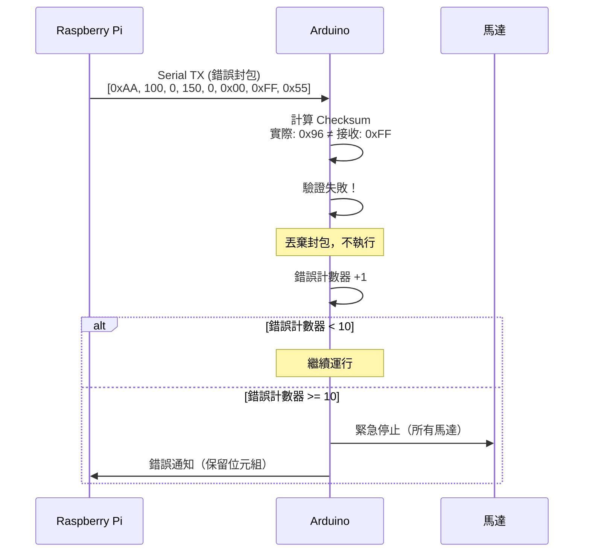
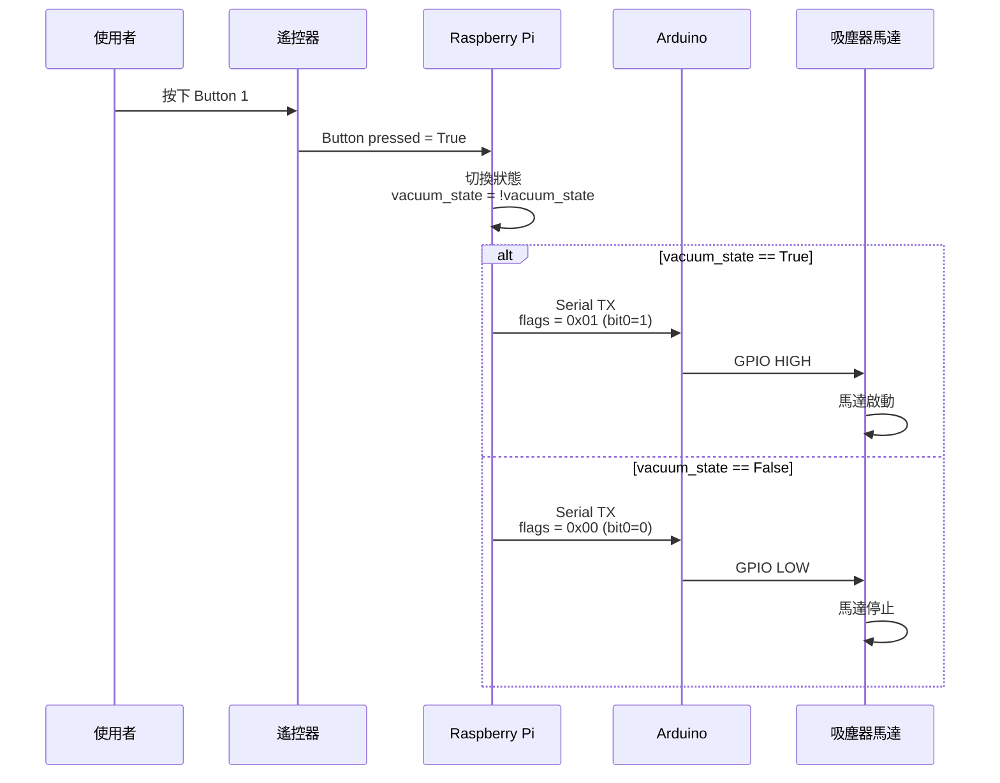
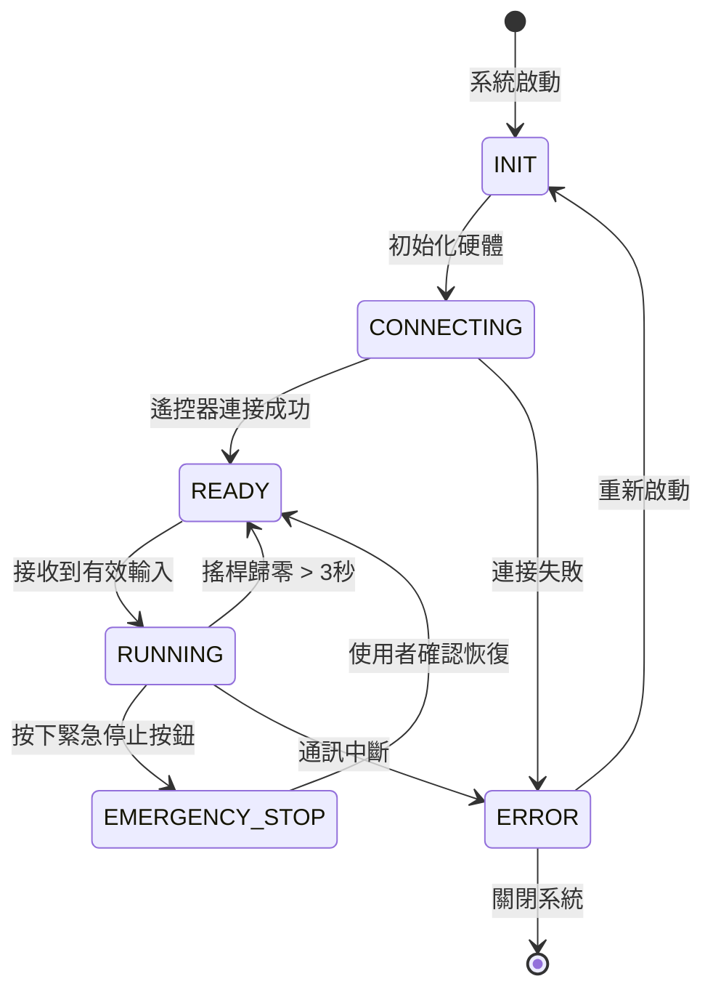
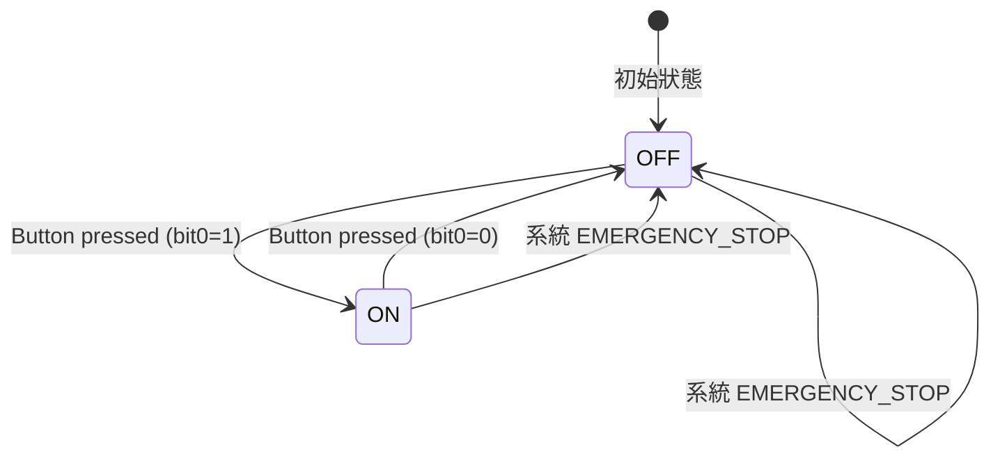

# SA - 系統分析文件
**System Analysis Document**

---

## 文件資訊

| 項目 | 內容 |
|------|------|
| 專案名稱 | 機電小車遙控系統 |
| 文件版本 | 1.1 |
| 建立日期 | 2025-10-31 |
| 最後更新 | 2025-10-31 |
| 作者 | Mechatronics Team |
| 參考文件 | 01_SRS_軟體需求規格書.md (v1.1) |

**修訂歷史**：
- v1.1 (2025-10-31): 修正 Checksum 計算描述，統一為 bytes 1-5
- v1.0 (2025-10-31): 初始版本

---

## 1. 使用案例分析 (Use Case Analysis)

### 1.1 Use Case Diagram



---

### 1.2 Use Case 詳細描述

#### UC1: 控制車輛移動

**參與者**：使用者

**前置條件**：
- 遙控器已連接並被系統識別
- 系統已啟動並進入 READY 狀態
- 電池電量足夠

**主要流程**：
1. 使用者操作搖桿（推/拉/左/右）
2. Raspberry Pi 讀取搖桿軸數值（X/Y）
3. Pi 正規化數值到 -1.0 ~ +1.0 範圍
4. Pi 套用死區過濾（|value| < 0.1 = 0）
5. Pi 計算差動驅動速度（left_speed, right_speed）
6. Pi 透過 Serial 發送馬達指令給 Arduino
7. Arduino 解析封包並驗證 Checksum
8. Arduino 控制 L298N 驅動馬達
9. 車輛移動（前進/後退/左轉/右轉）

**替代流程**：
- 3a. 搖桿數值異常 → 記錄警告，使用上一次有效值
- 7a. Checksum 驗證失敗 → 丟棄封包，不執行動作
- 9a. 偵測到障礙物（UC3）→ 減速或停止

**後置條件**：
- 車輛依照指令移動
- 感測器資料持續更新

---

#### UC2: 切換吸塵器開關

**參與者**：使用者

**前置條件**：
- 系統已啟動
- 吸塵器馬達已連接

**主要流程**：
1. 使用者按下遙控器按鈕（例如：Button 1）
2. Pi 讀取按鈕狀態（pressed = True）
3. Pi 切換吸塵器狀態（ON ↔ OFF）
4. Pi 將 flags byte bit0 設為對應狀態
5. Pi 透過 Serial 發送指令給 Arduino
6. Arduino 設定吸塵器馬達 GPIO（HIGH/LOW）
7. 吸塵器馬達啟動或停止

**替代流程**：
- 6a. 吸塵器馬達故障 → 記錄錯誤，停止輸出

**後置條件**：
- 吸塵器狀態已更新

---

#### UC3: 監控感測器資料

**參與者**：使用者（被動）

**前置條件**：
- Arduino 已啟動
- 超聲波感測器已連接

**主要流程**：
1. Arduino 每 100ms 觸發左側超聲波（Trig D7）
2. Arduino 測量 Echo 脈衝寬度（D8）
3. Arduino 計算距離：`distance_left = pulse * 0.034 / 2`
4. Arduino 觸發右側超聲波（Trig A1）
5. Arduino 測量 Echo 脈衝寬度（A2）
6. Arduino 計算距離：`distance_right = pulse * 0.034 / 2`
7. Arduino 透過 Serial 發送感測器封包給 Pi
8. Pi 解析封包並顯示距離資料

**替代流程**：
- 3a/6a. 距離超出範圍（< 2cm 或 > 400cm）→ 標記為無效，使用預設值 999
- 7a. Serial 緩衝區滿 → 丟棄最舊資料

**後置條件**：
- 使用者可看到即時距離資料

---

#### UC4: 緊急停止

**參與者**：使用者

**前置條件**：
- 系統正在運行

**主要流程**：
1. 使用者鬆開搖桿（歸零）或按下特定按鈕
2. Pi 偵測到緊急停止信號
3. Pi 立即發送 `left_pwm=0, right_pwm=0` 指令
4. Arduino 接收並設定所有馬達 GPIO 為 LOW
5. 車輛立即停止

**後置條件**：
- 所有馬達停止運轉

---

## 2. 資料流程圖 (Data Flow Diagram)

### 2.1 Level 0: Context Diagram



**外部實體**：
- 使用者：提供遙控輸入
- 環境：提供障礙物資訊、接收車輛動作

**資料流**：
- 輸入：搖桿 X/Y 數值、按鈕狀態
- 輸出：馬達控制信號、狀態資訊
- 環境回饋：超聲波反射（距離）

---

### 2.2 Level 1: 主要處理流程



---

### 2.3 資料字典 (Data Dictionary)

#### VehicleCommand（車輛控制指令）
| 欄位 | 類型 | 範圍 | 說明 |
|------|------|------|------|
| linear_velocity | float | -1.0 ~ +1.0 | 線性速度（前後） |
| angular_velocity | float | -1.0 ~ +1.0 | 角速度（左右轉） |
| vacuum_motor | bool | True/False | 吸塵器開關 |
| mode | string | MANUAL/AUTO/STOP | 控制模式 |

#### MotorCommand（馬達指令）
| 欄位 | 類型 | 範圍 | 說明 |
|------|------|------|------|
| left_pwm | int16 | -255 ~ +255 | 左輪 PWM |
| right_pwm | int16 | -255 ~ +255 | 右輪 PWM |
| vacuum_enable | bool | True/False | 吸塵器致能 |

#### SensorData（感測器資料）
| 欄位 | 類型 | 範圍 | 說明 |
|------|------|------|------|
| left_distance | uint16 | 2 ~ 400 | 左側距離 (cm) |
| right_distance | uint16 | 2 ~ 400 | 右側距離 (cm) |
| timestamp | uint32 | 0 ~ 2^32-1 | 時間戳記 (ms) |

---

## 3. 循序圖 (Sequence Diagram)

### 3.1 正常控制流程



---

### 3.2 錯誤處理流程



---

### 3.3 吸塵器控制流程



---

## 4. 狀態轉換圖 (State Transition Diagram)

### 4.1 系統狀態機



**狀態說明**：
- **INIT**：初始化 GPIO、Serial、感測器
- **CONNECTING**：等待遙控器連接（輪詢 `/dev/input/js*`）
- **READY**：系統就緒，等待輸入
- **RUNNING**：正常運行，執行控制迴圈
- **EMERGENCY_STOP**：緊急停止，所有馬達停止
- **ERROR**：錯誤狀態，等待恢復或重啟

---

### 4.2 吸塵器狀態機



---

## 5. 處理流程詳細說明

### 5.1 Process 1: 遙控器輸入處理

**輸入**：
- `/dev/input/js0` 裝置檔案
- 搖桿軸事件（Axis 0, Axis 1）
- 按鈕事件（Button 0, Button 1, ...）

**處理邏輯**：
```python
# 偽代碼
def process_joystick_input():
    pygame.event.pump()

    # 讀取搖桿軸
    raw_x = joystick.get_axis(0)  # -1.0 ~ +1.0
    raw_y = joystick.get_axis(1)  # -1.0 ~ +1.0

    # 死區過濾
    if abs(raw_x) < 0.1:
        raw_x = 0.0
    if abs(raw_y) < 0.1:
        raw_y = 0.0

    # 反轉 Y 軸（遙控器向前 = 正值）
    linear_velocity = -raw_y
    angular_velocity = -raw_x

    # 讀取按鈕
    vacuum_button = joystick.get_button(1)
    if vacuum_button:
        toggle_vacuum_state()

    return VehicleCommand(linear_velocity, angular_velocity, vacuum_state)
```

**輸出**：
- `VehicleCommand` 物件

---

### 5.2 Process 2: 馬達控制邏輯

**輸入**：
- `VehicleCommand` 物件

**處理邏輯**：
```python
# 偽代碼
def calculate_motor_speeds(cmd):
    # 差動驅動公式
    left_speed = cmd.linear_velocity - cmd.angular_velocity
    right_speed = cmd.linear_velocity + cmd.angular_velocity

    # 限制範圍 [-1.0, 1.0]
    left_speed = max(-1.0, min(1.0, left_speed))
    right_speed = max(-1.0, min(1.0, right_speed))

    # 轉換為 PWM (-255 ~ 255)
    left_pwm = int(left_speed * 255)
    right_pwm = int(right_speed * 255)

    return MotorCommand(left_pwm, right_pwm, cmd.vacuum_motor)
```

**輸出**：
- `MotorCommand` 物件

---

### 5.3 Process 3: Serial 通訊管理

**Pi 端發送**：
```python
# 偽代碼
def send_motor_command(cmd):
    packet = bytearray(8)
    packet[0] = 0xAA  # Header
    packet[1] = cmd.left_pwm & 0xFF
    packet[2] = (cmd.left_pwm >> 8) & 0xFF
    packet[3] = cmd.right_pwm & 0xFF
    packet[4] = (cmd.right_pwm >> 8) & 0xFF
    packet[5] = 0x01 if cmd.vacuum_enable else 0x00
    packet[6] = packet[1] ^ packet[2] ^ packet[3] ^ packet[4] ^ packet[5]  # Checksum
    packet[7] = 0x55  # Footer

    serial.write(packet)
```

**Arduino 端接收**：
```cpp
// 偽代碼
void receive_motor_command() {
    if (Serial.available() >= 8) {
        uint8_t packet[8];
        Serial.readBytes(packet, 8);

        // 驗證 Header/Footer
        if (packet[0] != 0xAA || packet[7] != 0x55) return;

        // 驗證 Checksum
        uint8_t checksum = packet[1] ^ packet[2] ^ packet[3] ^ packet[4] ^ packet[5];
        if (checksum != packet[6]) return;

        // 解析資料
        int16_t left_pwm = packet[1] | (packet[2] << 8);
        int16_t right_pwm = packet[3] | (packet[4] << 8);
        bool vacuum_enable = packet[5] & 0x01;

        // 執行控制
        set_motor(left_pwm, right_pwm, vacuum_enable);
    }
}
```

---

## 6. 時序需求分析

### 6.1 時序關鍵路徑

```
遙控器輸入 → Pi 讀取 → 計算速度 → Serial 傳輸 → Arduino 解析 → 馬達驅動
   < 5ms       < 2ms       < 1ms       < 5ms         < 3ms        < 2ms

總延遲：< 20ms （目標 < 50ms，餘裕度 30ms）
```

### 6.2 迴圈頻率設定

| 迴圈 | 頻率 | 週期 | 說明 |
|------|------|------|------|
| 主控制迴圈 | 50 Hz | 20 ms | Pi 端遙控器讀取 + 馬達控制 |
| 感測器讀取 | 10 Hz | 100 ms | Arduino 超聲波測距 |
| Serial 傳輸 | 50 Hz | 20 ms | 馬達指令（Pi→Arduino） |
| Serial 回傳 | 10 Hz | 100 ms | 感測器資料（Arduino→Pi） |

---

## 7. 錯誤處理策略

### 7.1 錯誤類型與處理

| 錯誤類型 | 偵測方式 | 處理策略 | 優先級 |
|----------|----------|----------|--------|
| 遙控器斷線 | `pygame.joystick.get_count() == 0` | 停止馬達，等待重連 | 高 |
| Serial 通訊中斷 | 超時無回應（> 200ms） | 重啟 Serial，記錄錯誤 | 高 |
| Checksum 錯誤 | XOR 驗證失敗 | 丟棄封包，錯誤計數+1 | 中 |
| 超聲波無效值 | 距離 < 2cm 或 > 400cm | 使用預設值 999 | 低 |
| 馬達過熱 | （未實作）電流監控 | 降低 PWM，警告使用者 | 中 |

### 7.2 錯誤恢復機制

**自動恢復**：
- Checksum 錯誤 < 10 次/秒：繼續運行
- 遙控器斷線後 5 秒內重連：自動恢復

**手動恢復**：
- Checksum 錯誤 >= 10 次/秒：進入 ERROR 狀態，需重啟
- Serial 通訊中斷：需重新啟動程式

---

## 8. 參考資料

- [01_SRS_軟體需求規格書.md](01_SRS_軟體需求規格書.md)
- [SYSTEM_ARCHITECTURE.md](../SYSTEM_ARCHITECTURE.md)
- IEEE 830-1998: Software Requirements Specification
- UML 2.5 Specification

---

**文件結束**
