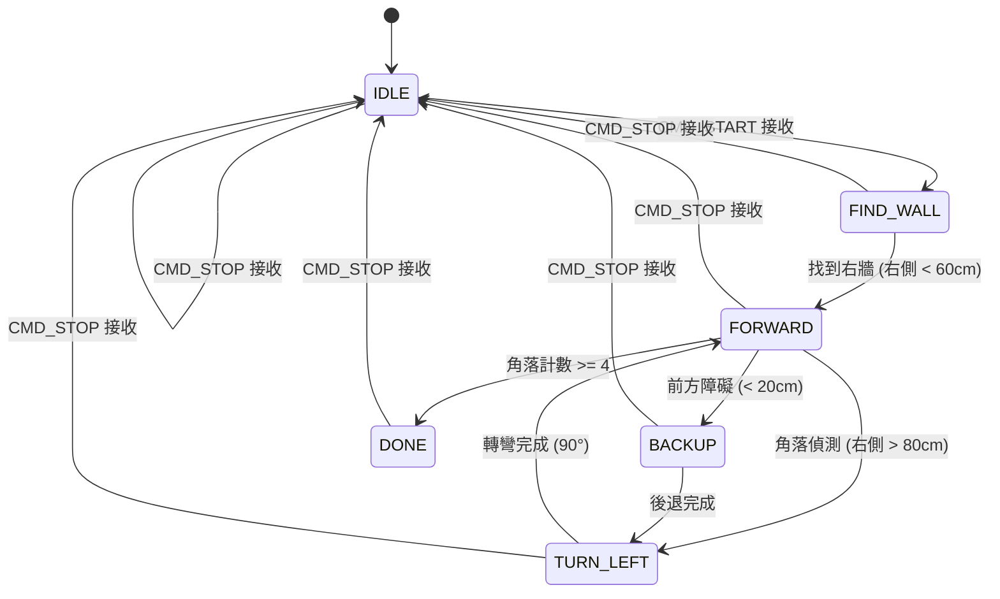
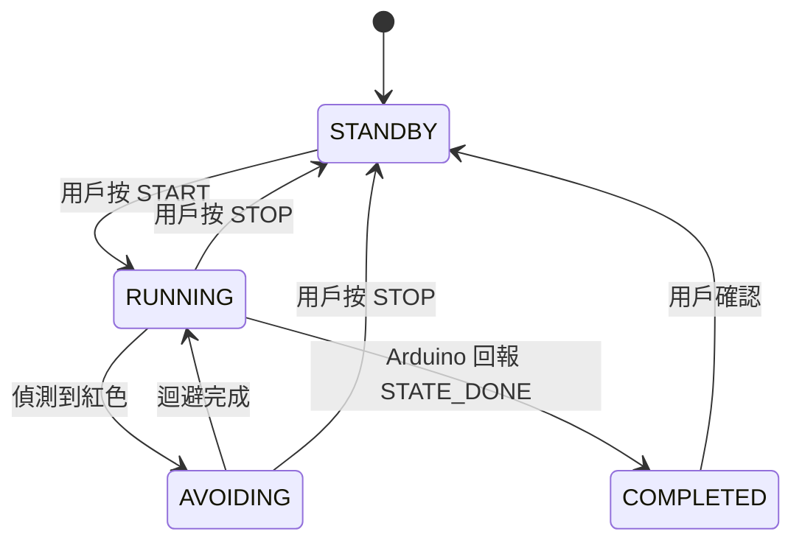

# ICD - 介面控制文件
**Interface Control Document**

---

## 文件資訊

| 項目 | 內容 |
|------|------|
| 專案名稱 | 機電小車遙控系統 |
| 文件版本 | 3.0 |
| 建立日期 | 2025-10-31 |
| 最後更新 | 2025-12-02 |
| 作者 | Mechatronics Team |
| 硬體平台 | Raspberry Pi 4 + Arduino Uno |

**修訂歷史**：
- v3.0 (2025-12-02): 新增 v2 自主架構協定，事件驅動指令系統，角落掃描狀態機
- v2.0 (2025-11-29): 新增 MPU6050 IMU 支援，感測器封包擴展為 12 bytes，新增 Yaw/GyroZ 資料
- v1.1 (2025-11-28): 更新通訊方式為 USB Serial，新增 ultrasonic_enable flag，超聲波配置改為 FRONT/RIGHT
- v1.0 (2025-10-31): 初始版本

---

## 1. 文件目的

本文件定義機電小車系統中所有硬體與軟體介面的詳細規格，包括：

- **Serial 通訊協定**：Raspberry Pi ↔ Arduino 的二進位通訊格式（v1 遙控架構 & v2 自主架構）
- **硬體接腳定義**：Arduino 和 Raspberry Pi 的 GPIO 腳位分配
- **電氣特性**：電壓、電流、時序要求
- **通訊時序**：封包傳輸時間與頻率限制
- **測試向量**：用於驗證介面正確性的範例資料

---

## 2. 架構說明

### 2.1 v1 遙控架構

```
┌─────────────────────────────────────────┐
│              Raspberry Pi               │
│  ┌─────────────┐  ┌──────────────────┐  │
│  │ 搖桿輸入    │→ │  差速運算        │  │
│  │ (pygame)    │  │  (50Hz)          │  │
│  └─────────────┘  └──────────────────┘  │
└─────────────────────────────────────────┘
                    │ Serial (高頻 50Hz)
                    │ Motor Command Packet
                    ▼
┌─────────────────────────────────────────┐
│                Arduino                   │
│  ┌─────────────────────────────────────┐│
│  │      馬達執行器                     ││
│  │  - 解析 PWM 指令                    ││
│  │  - L298N 驅動                       ││
│  └─────────────────────────────────────┘│
└─────────────────────────────────────────┘
```

**特性**：
- Pi 高頻發送馬達 PWM 指令（50Hz）
- Arduino 被動執行
- 適用遙控模式

### 2.2 v2 自主架構（期末系統）

```
┌─────────────────────────────────────────┐
│              Raspberry Pi               │
│  ┌─────────────┐  ┌──────────────────┐  │
│  │ 紅色辨識    │  │  高階狀態機      │  │
│  │ (OpenCV)    │  │  START/STOP/EXIT │  │
│  └─────────────┘  └──────────────────┘  │
└─────────────────────────────────────────┘
                    │ Serial (低頻事件)
                    │ Event Command
                    ▼
┌─────────────────────────────────────────┐
│                Arduino                   │
│  ┌─────────────────────────────────────┐│
│  │      自主沿牆狀態機 (50-100Hz)      ││
│  │  IDLE / FORWARD / BACKUP / TURN     ││
│  │  - 超聲波感測器 (FRONT/RIGHT)       ││
│  │  - MPU6050 IMU                      ││
│  │  - P 控制沿牆                       ││
│  │  - 角落偵測 + 左轉                  ││
│  └─────────────────────────────────────┘│
│                    │                    │
│                    ▼                    │
│  ┌─────────────────────────────────────┐│
│  │      馬達控制 (L298N)               ││
│  └─────────────────────────────────────┘│
└─────────────────────────────────────────┘
```

**特性**：
- Pi 低頻發送事件指令（START/STOP/AVOID_RED）
- Arduino 自主控制沿牆邏輯
- 低延遲、穩定性高
- 適用期末自主系統

---

## 3. Serial 通訊介面

### 3.1 通訊參數

| 參數 | 數值 | 說明 |
|------|------|------|
| 傳輸速率 | 9600 bps | 鮑率 |
| 資料位元 | 8 bits | 資料長度 |
| 同位元 | None | 無同位元檢查 |
| 停止位元 | 1 bit | 停止位元數 |
| 流量控制 | None | 無硬體流控 |
| 連接方式 | USB Serial | Raspberry Pi USB ↔ Arduino USB |

**連接方式**：

```
Raspberry Pi USB ──────────── Arduino USB (硬體 Serial via USB)
Raspberry Pi GND ──────────── Arduino GND (共地，透過 USB)
```

> **注意**：目前使用 USB Serial 連接，不再使用 GPIO UART。
> 裝置路徑：`/dev/ttyUSB0` 或 `/dev/ttyACM0`

---

## 4. v1 遙控架構協定

### 4.1 Pi → Arduino 指令封包 (Motor Command Packet)

#### 4.1.1 封包格式

| Byte 索引 | 欄位名稱 | 資料型別 | 範圍 | 說明 |
|-----------|---------|---------|------|------|
| 0 | Header | uint8 | 0xAA | 封包起始標記 |
| 1 | Left PWM Low | uint8 | 0x00 ~ 0xFF | 左輪 PWM 低位元組 |
| 2 | Left PWM High | uint8 | 0x00 ~ 0xFF | 左輪 PWM 高位元組 |
| 3 | Right PWM Low | uint8 | 0x00 ~ 0xFF | 右輪 PWM 低位元組 |
| 4 | Right PWM High | uint8 | 0x00 ~ 0xFF | 右輪 PWM 高位元組 |
| 5 | Flags | uint8 | 0x00 ~ 0xFF | 控制旗標 |
| 6 | Checksum | uint8 | 0x00 ~ 0xFF | 校驗和 (XOR) |
| 7 | Footer | uint8 | 0x55 | 封包結束標記 |

**總計**：8 bytes

#### 4.1.2 資料編碼規則

**PWM 數值編碼 (int16, 2's Complement)**：

```python
# int16 範圍：-255 ~ +255
# 正值：前進，負值：後退，0：停止

# 編碼（Python）：
left_pwm = 127  # 前進半速
low_byte = left_pwm & 0xFF          # 0x7F
high_byte = (left_pwm >> 8) & 0xFF  # 0x00

left_pwm = -100  # 後退
# int16 的 2's complement 表示：-100 = 0xFF9C
low_byte = (-100) & 0xFF            # 0x9C
high_byte = ((-100) >> 8) & 0xFF    # 0xFF
```

**解碼（Arduino C++）**：

```cpp
int16_t left_pwm = (int16_t)(packet[1] | (packet[2] << 8));
// packet[1]=0x9C, packet[2]=0xFF → 0xFF9C → -100
```

**Flags Byte 定義**：

| Bit | 名稱 | 說明 |
|-----|------|------|
| 0 | vacuum_motor | 1 = 吸塵器開啟，0 = 關閉 |
| 1 | ultrasonic_enable | 1 = 啟用超聲波讀取，0 = 停用 |
| 2-6 | reserved | 保留 (預設 0) |
| 7 | emergency_stop | 1 = 緊急停止 (未來功能) |

**Checksum 計算**：

```python
checksum = packet[1] ^ packet[2] ^ packet[3] ^ packet[4] ^ packet[5]
```

#### 4.1.3 封包範例

**範例 1：前進全速（左右輪 PWM = 255）**

| Byte | 欄位 | 數值 (Hex) | 數值 (Dec) | 計算過程 |
|------|------|-----------|-----------|---------|
| 0 | Header | 0xAA | 170 | 固定值 |
| 1 | Left PWM Low | 0xFF | 255 | 255 & 0xFF |
| 2 | Left PWM High | 0x00 | 0 | (255 >> 8) & 0xFF |
| 3 | Right PWM Low | 0xFF | 255 | 255 & 0xFF |
| 4 | Right PWM High | 0x00 | 0 | (255 >> 8) & 0xFF |
| 5 | Flags | 0x00 | 0 | 無旗標 |
| 6 | Checksum | 0x00 | 0 | 0xFF^0x00^0xFF^0x00^0x00 |
| 7 | Footer | 0x55 | 85 | 固定值 |

**完整封包**：`AA FF 00 FF 00 00 00 55`

### 4.2 Arduino → Pi 感測器封包 (Sensor Data Packet)

#### 4.2.1 封包格式 (v2.0 - 12 bytes)

| Byte 索引 | 欄位名稱 | 資料型別 | 範圍 | 說明 |
|-----------|---------|---------|------|------|
| 0 | Header | uint8 | 0xBB | 封包起始標記 |
| 1 | Front Dist Low | uint8 | 0x00 ~ 0xFF | 前方距離低位元組 |
| 2 | Front Dist High | uint8 | 0x00 ~ 0xFF | 前方距離高位元組 |
| 3 | Right Dist Low | uint8 | 0x00 ~ 0xFF | 右側距離低位元組 |
| 4 | Right Dist High | uint8 | 0x00 ~ 0xFF | 右側距離高位元組 |
| 5 | Yaw Low | uint8 | 0x00 ~ 0xFF | Yaw 角度低位元組 (int16, 0.1度) |
| 6 | Yaw High | uint8 | 0x00 ~ 0xFF | Yaw 角度高位元組 |
| 7 | GyroZ | int8 | 0x00 ~ 0xFF | Z 軸角速度 (度/秒, -128~127) |
| 8 | Status | uint8 | 0x00 ~ 0xFF | 狀態旗標 |
| 9 | Reserved | uint8 | 0x00 | 保留 |
| 10 | Checksum | uint8 | 0x00 ~ 0xFF | 校驗和 (XOR bytes 1-9) |
| 11 | Footer | uint8 | 0x66 | 封包結束標記 |

**總計**：12 bytes

**Status Byte 定義 (v2.0)**：

| Bit | 名稱 | 說明 |
|-----|------|------|
| 0 | front_sensor_valid | 1 = 前方感測器資料有效，0 = 無效 |
| 1 | right_sensor_valid | 1 = 右側感測器資料有效，0 = 無效 |
| 2 | imu_valid | 1 = IMU 資料有效，0 = 無效 |
| 3 | vacuum_motor_status | 1 = 吸塵器運作中，0 = 關閉 |
| 4-7 | reserved | 保留 (預設 0) |

**Checksum 計算**：

```cpp
// 12-byte 封包：XOR bytes 1-9
checksum = packet[1] ^ packet[2] ^ packet[3] ^ packet[4] ^ packet[5]
         ^ packet[6] ^ packet[7] ^ packet[8] ^ packet[9];
```

---

## 5. v2 自主架構協定（期末系統）

### 5.1 通訊模型

v2 架構採用**事件驅動**通訊模式：

- **低頻率**：Pi 僅在狀態變更時發送指令（非週期性）
- **高自主性**：Arduino 自主執行沿牆控制邏輯
- **降低負載**：避免 Serial buffer 溢位問題

### 5.2 Pi → Arduino 事件指令封包

#### 5.2.1 封包格式

```
[HEADER=0xAA][CMD][PAYLOAD_LEN][PAYLOAD][CHECKSUM][FOOTER=0x55]
```

| Byte 索引 | 欄位名稱 | 資料型別 | 範圍 | 說明 |
|-----------|---------|---------|------|------|
| 0 | Header | uint8 | 0xAA | 封包起始標記 |
| 1 | CMD | uint8 | 0x01 ~ 0xFF | 指令類型 |
| 2 | Payload Length | uint8 | 0x00 ~ 0xFF | Payload 長度 (0-255 bytes) |
| 3 ~ (3+n-1) | Payload | uint8[] | - | 指令參數 |
| 3+n | Checksum | uint8 | 0x00 ~ 0xFF | CMD ^ PAYLOAD_LEN ^ PAYLOAD[0] ^ ... |
| 4+n | Footer | uint8 | 0x55 | 封包結束標記 |

**總長度**：5 + PAYLOAD_LEN bytes

#### 5.2.2 指令定義

| 指令 | 值 | Payload | 說明 |
|------|-----|---------|------|
| CMD_START | 0x01 | 無 (0 bytes) | 開始自主沿牆控制 |
| CMD_STOP | 0x02 | 無 (0 bytes) | 停止執行，回到 IDLE 狀態 |
| CMD_AVOID_RED | 0x03 | 無 (0 bytes) | 觸發紅色區域迴避行為 |
| CMD_SET_VACUUM | 0x04 | 1 byte (0x00/0x01) | 設定吸塵器開關（0x00=關閉, 0x01=開啟） |
| CMD_QUERY_STATE | 0x05 | 無 (0 bytes) | 查詢當前狀態（觸發狀態回報） |

#### 5.2.3 Checksum 計算

```python
# Python
def calc_cmd_checksum(cmd: int, payload: bytes) -> int:
    checksum = cmd ^ len(payload)
    for byte in payload:
        checksum ^= byte
    return checksum
```

```cpp
// Arduino C++
uint8_t calc_cmd_checksum(uint8_t cmd, uint8_t payload_len, const uint8_t* payload) {
    uint8_t checksum = cmd ^ payload_len;
    for (uint8_t i = 0; i < payload_len; i++) {
        checksum ^= payload[i];
    }
    return checksum;
}
```

#### 5.2.4 封包範例

**範例 1：CMD_START（開始沿牆）**

```
0xAA 0x01 0x00 0x01 0x55
│    │    │    │    └─ Footer
│    │    │    └─ Checksum (0x01 ^ 0x00 = 0x01)
│    │    └─ Payload Length (0)
│    └─ CMD_START
└─ Header
```

**完整封包**：`AA 01 00 01 55`

---

**範例 2：CMD_SET_VACUUM（開啟吸塵器）**

```
0xAA 0x04 0x01 0x01 0x04 0x55
│    │    │    │    │    └─ Footer
│    │    │    │    └─ Checksum (0x04 ^ 0x01 ^ 0x01 = 0x04)
│    │    │    └─ Payload[0] (0x01 = VACUUM_ON)
│    │    └─ Payload Length (1)
│    └─ CMD_SET_VACUUM
└─ Header
```

**完整封包**：`AA 04 01 01 04 55`

---

**範例 3：CMD_AVOID_RED（迴避紅色）**

```
0xAA 0x03 0x00 0x03 0x55
```

**完整封包**：`AA 03 00 03 55`

### 5.3 Arduino → Pi 狀態回報封包

#### 5.3.1 封包格式

```
[HEADER=0xBB][STATE][CORNER_COUNT][FRONT_DIST_H][FRONT_DIST_L]
[RIGHT_DIST_H][RIGHT_DIST_L][YAW_H][YAW_L][FLAGS][CHECKSUM][FOOTER=0x66]
```

| Byte 索引 | 欄位名稱 | 資料型別 | 範圍 | 說明 |
|-----------|---------|---------|------|------|
| 0 | Header | uint8 | 0xBB | 封包起始標記 |
| 1 | State | uint8 | 0x00 ~ 0xFF | 當前狀態代碼 |
| 2 | Corner Count | uint8 | 0x00 ~ 0xFF | 已掃描角落數 |
| 3 | Front Dist High | uint8 | 0x00 ~ 0xFF | 前方距離高位元組 (cm) |
| 4 | Front Dist Low | uint8 | 0x00 ~ 0xFF | 前方距離低位元組 (cm) |
| 5 | Right Dist High | uint8 | 0x00 ~ 0xFF | 右側距離高位元組 (cm) |
| 6 | Right Dist Low | uint8 | 0x00 ~ 0xFF | 右側距離低位元組 (cm) |
| 7 | Yaw High | uint8 | 0x00 ~ 0xFF | 偏航角高位元組 (0.1° 單位) |
| 8 | Yaw Low | uint8 | 0x00 ~ 0xFF | 偏航角低位元組 (0.1° 單位) |
| 9 | Flags | uint8 | 0x00 ~ 0xFF | 狀態旗標 |
| 10 | Checksum | uint8 | 0x00 ~ 0xFF | XOR bytes 1-9 |
| 11 | Footer | uint8 | 0x66 | 封包結束標記 |

**總計**：12 bytes（固定長度）

#### 5.3.2 狀態碼定義

| 狀態 | 值 | 說明 |
|------|-----|------|
| STATE_IDLE | 0x00 | 空閒/待命，等待指令 |
| STATE_FIND_WALL | 0x01 | 搜尋右側牆面中 |
| STATE_FORWARD | 0x02 | 前進並沿右牆行駛 |
| STATE_BACKUP | 0x03 | 後退（前方障礙） |
| STATE_TURN_LEFT | 0x04 | 左轉 90 度（角落掃描） |
| STATE_DONE | 0x05 | 任務完成（掃描完 4 個角落） |
| STATE_ERROR | 0xFF | 錯誤狀態（感測器故障） |

#### 5.3.3 Flags Byte 定義

| Bit | 名稱 | 說明 |
|-----|------|------|
| 0 | red_detected | 1 = 偵測到紅色區域（Pi 通知），0 = 無 |
| 1 | target_reached | 1 = 達到目標位置，0 = 未達到 |
| 2 | vacuum_enabled | 1 = 吸塵器啟用，0 = 關閉 |
| 3 | sensor_error | 1 = 傳感器故障，0 = 正常 |
| 4-7 | reserved | 保留 (預設 0) |

#### 5.3.4 資料編碼

**距離編碼 (uint16, cm)**：

```cpp
// Arduino 編碼
uint16_t front_distance = 150;  // cm
packet[3] = (front_distance >> 8) & 0xFF;  // High byte
packet[4] = front_distance & 0xFF;         // Low byte
```

```python
# Python 解碼
front_distance = (packet[3] << 8) | packet[4]
```

**Yaw 編碼 (uint16, 0.1° 單位)**：

```cpp
// Arduino 編碼
float yaw_deg = 45.3;  // 度
uint16_t yaw_encoded = (uint16_t)(yaw_deg * 10);  // 453
packet[7] = (yaw_encoded >> 8) & 0xFF;  // High byte
packet[8] = yaw_encoded & 0xFF;         // Low byte
```

```python
# Python 解碼
yaw_raw = (packet[7] << 8) | packet[8]
yaw_deg = yaw_raw / 10.0  # 45.3
```

#### 5.3.5 Checksum 計算

```cpp
// Arduino C++
uint8_t calc_state_checksum(const uint8_t* packet) {
    uint8_t checksum = 0;
    for (uint8_t i = 1; i <= 9; i++) {  // bytes 1-9
        checksum ^= packet[i];
    }
    return checksum;
}
```

```python
# Python
def calc_state_checksum(data: bytes) -> int:
    """data = bytes 1-9"""
    checksum = 0
    for byte in data:
        checksum ^= byte
    return checksum
```

#### 5.3.6 封包範例

**範例 1：FORWARD 狀態（前進沿牆，2 個角落，前方 150cm，右側 45cm，Yaw 123.4°）**

| Byte | 欄位 | 數值 (Hex) | 數值 (Dec) | 說明 |
|------|------|-----------|-----------|------|
| 0 | Header | 0xBB | 187 | 固定值 |
| 1 | State | 0x02 | 2 | STATE_FORWARD |
| 2 | Corner Count | 0x02 | 2 | 已掃描 2 個角落 |
| 3 | Front Dist H | 0x00 | 0 | 150 >> 8 |
| 4 | Front Dist L | 0x96 | 150 | 150 & 0xFF |
| 5 | Right Dist H | 0x00 | 0 | 45 >> 8 |
| 6 | Right Dist L | 0x2D | 45 | 45 & 0xFF |
| 7 | Yaw H | 0x04 | 4 | 1234 >> 8 (123.4° × 10) |
| 8 | Yaw L | 0xD2 | 210 | 1234 & 0xFF |
| 9 | Flags | 0x04 | 4 | bit2=1 (吸塵器啟用) |
| 10 | Checksum | 0x99 | 153 | XOR bytes 1-9 |
| 11 | Footer | 0x66 | 102 | 固定值 |

**完整封包**：`BB 02 02 00 96 00 2D 04 D2 04 99 66`

---

**範例 2：DONE 狀態（任務完成，4 個角落）**

| Byte | 欄位 | 數值 (Hex) | 數值 (Dec) | 說明 |
|------|------|-----------|-----------|------|
| 0 | Header | 0xBB | 187 | 固定值 |
| 1 | State | 0x05 | 5 | STATE_DONE |
| 2 | Corner Count | 0x04 | 4 | 已掃描 4 個角落 |
| 3-8 | Distances/Yaw | ... | ... | 當前感測值 |
| 9 | Flags | 0x06 | 6 | bit1=1 (達標), bit2=1 (吸塵器) |
| 10 | Checksum | ... | ... | XOR bytes 1-9 |
| 11 | Footer | 0x66 | 102 | 固定值 |

### 5.4 通訊時序

```
時間軸 (ms)
0       50      100     150     200
│       │       │       │       │
│       ▼       ▼       ▼       ▼
│     [Arduino 自主控制 100Hz]
│
├─ Pi 發送 CMD_START (事件)
│
│     [Arduino: IDLE → FIND_WALL → FORWARD]
│
├─ Arduino 回報狀態 (10Hz, 每 100ms)
│       ▼       ▼       ▼       ▼
│     STATE   STATE   STATE   STATE
│
├─ Pi 偵測到紅色 (事件)
│
├─ Pi 發送 CMD_AVOID_RED
│
│     [Arduino: 執行迴避動作]
```

**特性**：
- Pi → Arduino：事件驅動（非週期性）
- Arduino → Pi：狀態回報 10Hz（每 100ms）
- Arduino 內部控制迴圈：50-100Hz

---

## 6. 狀態機圖

### 6.1 v2 Arduino 自主沿牆狀態機



**狀態說明**：

| 狀態 | 行為 | 退出條件 |
|------|------|---------|
| IDLE | 馬達停止，等待指令 | 收到 CMD_START |
| FIND_WALL | 右轉搜尋牆面 | 右側距離 < 60cm |
| FORWARD | P 控制沿右牆前進 | 前方 < 20cm 或 右側 > 80cm |
| BACKUP | 後退 30cm | 後退時間到 |
| TURN_LEFT | 左轉 90° (IMU 導引) | Yaw 角度增加 90° |

### 6.2 v2 Pi 高階狀態機



---

## 7. 硬體接腳定義

### 7.1 Arduino Uno 腳位分配

#### 7.1.1 數位腳位 (Digital Pins)

| Arduino 腳位 | 功能 | 連接對象 | 方向 | PWM | 說明 |
|-------------|------|---------|------|-----|------|
| D0 | RX (保留) | - | - | ✗ | 保留給 USB Serial（除錯用） |
| D1 | TX (保留) | - | - | ✗ | 保留給 USB Serial（除錯用） |
| D3 | L298N ENA | L298N ENA | OUT | ✓ | 左輪 PWM 速度控制 |
| D5 | L298N IN1 | L298N IN1 | OUT | ✗ | 左輪方向 A |
| D6 | L298N IN2 | L298N IN2 | OUT | ✗ | 左輪方向 B |
| D7 | Ultrasonic F Trig | HC-SR04 #1 Trig | OUT | ✗ | 前方超聲波觸發 |
| D8 | Ultrasonic F Echo | HC-SR04 #1 Echo | IN | ✗ | 前方超聲波回波 |
| D9 | L298N IN3 | L298N IN3 | OUT | ✗ | 右輪方向 A |
| D10 | L298N IN4 | L298N IN4 | OUT | ✗ | 右輪方向 B |
| D11 | L298N ENB | L298N ENB | OUT | ✓ | 右輪 PWM 速度控制 |
| D12 | Vacuum Motor | MOSFET Gate | OUT | ✗ | 吸塵器馬達開關 |
| D13 | Status LED | 板載 LED | OUT | ✗ | 狀態指示（可選） |

#### 7.1.2 類比腳位 (Analog Pins)

| Arduino 腳位 | 功能 | 連接對象 | 方向 | 說明 |
|-------------|------|---------|------|------|
| A0 | (保留) | - | - | 保留（未來電池電壓偵測） |
| A1 | Ultrasonic R Trig | HC-SR04 #2 Trig | OUT | 右側超聲波觸發 |
| A2 | Ultrasonic R Echo | HC-SR04 #2 Echo | IN | 右側超聲波回波 |
| A3 | Vacuum Motor | Relay / MOSFET | OUT | 吸塵器繼電器控制 |
| A4 | I2C SDA | MPU6050 SDA | I/O | IMU 資料線 (v2.0) |
| A5 | I2C SCL | MPU6050 SCL | OUT | IMU 時脈線 (v2.0) |

#### 7.1.3 電源腳位

| Arduino 腳位 | 電壓 | 連接對象 | 說明 |
|-------------|------|---------|------|
| 5V | 5.0V | HC-SR04 VCC, MPU6050 VCC | 感測器電源 |
| 3.3V | 3.3V | - | 保留 |
| GND | 0V | 系統共地 | **必須連接所有 GND** |
| VIN | 7-12V | DC-DC 降壓模組 | 5V 輸入 |

---

### 7.2 Raspberry Pi 4 GPIO 腳位分配

#### 7.2.1 GPIO 腳位表

| BCM 編號 | 物理腳位 | 功能 | 連接對象 | 方向 | 說明 |
|---------|---------|------|---------|------|------|
| GPIO14 | Pin 8 | UART TXD | Arduino (USB Serial) | OUT | Serial 發送 |
| GPIO15 | Pin 10 | UART RXD | Arduino (USB Serial) | IN | Serial 接收 |
| GPIO2 | Pin 3 | I2C SDA | - | - | 保留（未來擴充） |
| GPIO3 | Pin 5 | I2C SCL | - | - | 保留（未來擴充） |
| GPIO4 | Pin 7 | (保留) | - | - | 保留 |
| GND | Pin 6, 9, 14, 20... | 接地 | 系統共地 | - | **必須連接 Arduino GND** |
| 5V | Pin 2, 4 | 電源輸出 | - | - | **不建議直接使用** |

---

## 8. 電氣特性

### 8.1 電壓電平

| 信號 | 邏輯 HIGH | 邏輯 LOW | 說明 |
|------|----------|---------|------|
| Arduino GPIO | 5.0V ± 0.5V | 0V | 5V CMOS |
| Raspberry Pi GPIO | 3.3V ± 0.3V | 0V | 3.3V CMOS |
| L298N 輸入 | > 2.3V | < 0.8V | TTL 相容 |
| HC-SR04 Echo | 5.0V | 0V | 5V CMOS |

### 8.2 PWM 特性

| Arduino 腳位 | 預設頻率 | 解析度 | 範圍 | 說明 |
|-------------|---------|-------|------|------|
| D3 (ENA) | 490 Hz | 8-bit | 0-255 | 左輪速度 |
| D11 (ENB) | 490 Hz | 8-bit | 0-255 | 右輪速度 |

---

## 9. 通訊時序需求

### 9.1 v1 遙控架構時序

| 階段 | 時間 (ms) | 頻率 (Hz) | 說明 |
|------|----------|----------|------|
| 搖桿讀取 | 1 | 50 | pygame 事件輪詢 |
| 差動運算 | < 0.1 | 50 | CPU 計算 |
| 封包建構 | < 0.1 | 50 | 封包組裝 |
| Serial 傳輸 | 1.39 | 50 | 8 bytes @ 57600 bps |
| Arduino 處理 | 1 | 50 | 解析 + 執行 |
| 馬達響應 | < 5 | 50 | PWM 更新 |
| **端對端延遲** | **< 10** | **50** | **搖桿 → 馬達** |

### 9.2 v2 自主架構時序

| 階段 | 時間 (ms) | 頻率 (Hz) | 說明 |
|------|----------|----------|------|
| Arduino 控制迴圈 | 10-20 | 50-100 | 狀態機 + P 控制 |
| 超聲波測距 | 2-24 | 10 | 雙感測器序列測距 |
| IMU 讀取 | < 1 | 100 | MPU6050 I2C |
| 狀態回報 | 1.39 | 10 | 12 bytes @ 9600 bps |
| Pi 事件指令 | - | 事件驅動 | START/STOP/AVOID_RED |
| **端對端延遲** | **< 50** | **10** | **Pi 指令 → Arduino 執行** |

---

## 10. 測試向量

### 10.1 v1 遙控架構測試集

#### 測試案例 1：基本前進/後退

| 測試編號 | Left PWM | Right PWM | Vacuum | 完整封包 (Hex) | 預期行為 |
|---------|---------|-----------|--------|---------------|---------|
| T1-01 | 255 | 255 | 0 | `AA FF 00 FF 00 00 00 55` | 全速前進 |
| T1-02 | 127 | 127 | 0 | `AA 7F 00 7F 00 00 00 55` | 半速前進 |
| T1-03 | -255 | -255 | 0 | `AA 01 FF 01 FF 00 FE 55` | 全速後退 |
| T1-04 | 0 | 0 | 0 | `AA 00 00 00 00 00 00 55` | 停止 |

### 10.2 v2 自主架構測試集

#### 測試案例 2：事件指令

| 測試編號 | 指令 | 完整封包 (Hex) | 預期行為 |
|---------|------|---------------|---------|
| T2-01 | CMD_START | `AA 01 00 01 55` | Arduino 進入 FIND_WALL 狀態 |
| T2-02 | CMD_STOP | `AA 02 00 02 55` | Arduino 進入 IDLE 狀態 |
| T2-03 | CMD_AVOID_RED | `AA 03 00 03 55` | Arduino 執行迴避動作 |
| T2-04 | CMD_SET_VACUUM (ON) | `AA 04 01 01 04 55` | 吸塵器開啟 |
| T2-05 | CMD_SET_VACUUM (OFF) | `AA 04 01 00 05 55` | 吸塵器關閉 |
| T2-06 | CMD_QUERY_STATE | `AA 05 00 05 55` | Arduino 立即回報狀態 |

#### 測試案例 3：狀態回報

| 測試編號 | State | Corners | Front | Right | Yaw | Flags | 預期解析 |
|---------|-------|---------|-------|-------|-----|-------|---------|
| T3-01 | IDLE (0x00) | 0 | 999 | 999 | 0 | 0x00 | 待命中 |
| T3-02 | FORWARD (0x02) | 2 | 150 | 45 | 1234 | 0x04 | 沿牆前進，吸塵器啟用 |
| T3-03 | TURN_LEFT (0x04) | 3 | 50 | 80 | 900 | 0x04 | 左轉中，第 3 個角落 |
| T3-04 | DONE (0x05) | 4 | 100 | 50 | 3600 | 0x06 | 任務完成，達標 |

#### 測試案例 4：錯誤處理

| 測試編號 | 封包 (Hex) | 錯誤類型 | 預期行為 |
|---------|-----------|---------|---------|
| T4-01 | `BB 01 00 01 55` | Header 錯誤 (0xBB 用於指令) | 丟棄封包 |
| T4-02 | `AA 01 00 FF 55` | Checksum 錯誤 | 丟棄封包 |
| T4-03 | `AA 01` (逾時) | 封包不完整 | 逾時丟棄 |
| T4-04 | `AA 01 05 55` (缺 payload) | Payload 長度不符 | 丟棄封包 |

---

## 11. 介面變更管理

### 11.1 版本控制

| 介面 | 版本 | 變更日期 | 變更說明 |
|------|------|---------|---------|
| Serial Protocol | 3.0 | 2025-12-02 | 新增 v2 自主架構事件驅動協定 |
| Serial Protocol | 2.0 | 2025-11-29 | 感測器封包擴展為 12 bytes，新增 IMU 欄位 |
| Serial Protocol | 1.1 | 2025-11-28 | 新增 ultrasonic_enable flag |
| Serial Protocol | 1.0 | 2025-10-31 | 初始版本 |
| Pin Assignment | 2.0 | 2025-11-29 | A3 改為吸塵器，A4/A5 用於 MPU6050 I2C |
| Pin Assignment | 1.0 | 2025-10-31 | 初始版本 |

### 11.2 相容性矩陣

| Pi 軟體版本 | Arduino 韌體版本 | Serial 協定版本 | 相容性 |
|-----------|----------------|---------------|-------|
| 3.0 (v2 自主) | 3.0 (v2 自主) | 3.0 | ✅ 完全相容 (事件驅動) |
| 2.0 (v1 遙控) | 2.0 (v1 遙控) | 2.0 | ✅ 完全相容 (IMU 支援) |
| 3.0 (v2 自主) | 2.0 (v1 遙控) | - | ❌ 不相容 (協定不同) |
| 2.0 (v1 遙控) | 3.0 (v2 自主) | - | ❌ 不相容 (協定不同) |
| 1.0 | 1.0 | 1.0 | ✅ 完全相容 (無 IMU) |

---

## 12. 參考標準

- **Serial 通訊**：RS-232 標準（簡化版）
- **PWM 信號**：IEC 61131-3
- **超聲波測距**：HC-SR04 Datasheet
- **馬達驅動**：L298N Datasheet
- **IMU 感測器**：MPU6050 Datasheet
- **GPIO 電氣特性**：
  - Arduino: ATmega328P Datasheet
  - Raspberry Pi: BCM2711 ARM Peripherals Manual

---

## 13. 附錄

### 13.1 v2 架構狀態名稱映射（Python）

```python
STATE_NAMES = {
    0x00: "IDLE",
    0x01: "FIND_WALL",
    0x02: "FORWARD",
    0x03: "BACKUP",
    0x04: "TURN_LEFT",
    0x05: "DONE",
    0xFF: "ERROR",
}

CMD_NAMES = {
    0x01: "START",
    0x02: "STOP",
    0x03: "AVOID_RED",
    0x04: "SET_VACUUM",
    0x05: "QUERY_STATE",
}
```

### 13.2 常見問題 (FAQ)

**Q1: v1 和 v2 架構的主要差異？**
A1: v1 是遙控架構（Pi 高頻發送 PWM 指令），v2 是自主架構（Arduino 自主沿牆，Pi 低頻事件指令）。

**Q2: 為什麼 v2 使用事件驅動而非週期性指令？**
A2: 降低 Serial 負載，避免 buffer 溢位，提升穩定性。Arduino 自主控制延遲更低。

**Q3: v2 架構如何處理紅色區域？**
A3: Pi 使用 OpenCV 持續監測，偵測到紅色時發送 CMD_AVOID_RED 事件，Arduino 執行迴避動作。

**Q4: 角落掃描如何判斷完成？**
A4: Arduino 維護 corner_count 變數，每次執行 TURN_LEFT 時 +1，當 corner_count >= 4 時進入 DONE 狀態。

**Q5: v2 架構的 Yaw 角度用途？**
A5: 用於左轉 90° 的精確控制，IMU 提供角度回饋，確保轉彎角度準確。

---

**文件結束**
